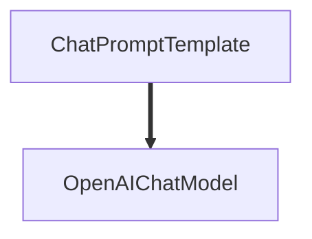

## Overview

Runnable Chains provide a declarative way to compose AI components into sophisticated chains. Without Runnable Chains, building complex AI workflows requires verbose code with manual data passing and error handling. With Runnable Chains, you can:

- **Chain components elegantly** using the pipe operator (`|`) for readable, maintainable code
- **Execute operations in parallel** to maximize performance and reduce latency
- **Build dynamic chains** that adapt based on input conditions
- **Manage conversation history** seamlessly across interactions
- **Integrate tools and structured outputs** with minimal boilerplate
- **Visualize your chains** to understand complex workflows at a glance

Runnable Chains make your AI applications more modular, testable, and production-ready.

---

## Core Concepts

### The Pipe Operator

The foundation of Runnable Chains is the pipe operator (`|`), which chains components together. Each component receives the output of the previous one:

```python
from upsonic.uel import ChatPromptTemplate
from upsonic.models import infer_model

# Chain components with the pipe operator
chain = (
    ChatPromptTemplate.from_template("Tell me about {topic}") 
    | infer_model("openai/gpt-5")
)

result = chain.invoke({"topic": "quantum computing"})
```

### Runnables

Every component in Runnable Chains is a `Runnable` - an object with `invoke()` and `ainvoke()` methods. This unified interface allows any component to be used in chains:

- **Prompts**: `ChatPromptTemplate`
- **Models**: Any model from `infer_model()`
- **Functions**: Wrapped with `RunnableLambda` or `@chain` decorator
- **Data structures**: Automatically converted (dicts become `RunnableParallel`)

---

## Building Blocks

### ChatPromptTemplate

Create dynamic prompts with variable substitution and message formatting.

#### Simple Templates

```python
from upsonic.uel import ChatPromptTemplate

# Single template with variables
template = ChatPromptTemplate.from_template(
    "Tell me a {adjective} joke about {topic}"
)

result = template.invoke({
    "adjective": "funny",
    "topic": "programming"
})
```

#### Message-Based Templates

```python
# System and user messages
template = ChatPromptTemplate.from_messages([
    ("system", "You are a {role}."),
    ("human", "Tell me about {topic}")
])

result = template.invoke({
    "role": "Python expert",
    "topic": "asyncio"
})
```

#### Chat History with Placeholders

```python
# Inject conversation history dynamically
template = ChatPromptTemplate.from_messages([
    ("system", "You are a helpful assistant."),
    ("placeholder", {"variable_name": "chat_history"}),
    ("human", "{question}")
])

result = template.invoke({
    "chat_history": [
        ("human", "What's Python?"),
        ("ai", "Python is a programming language.")
    ],
    "question": "What are its main features?"
})
```

#### Few-Shot Examples

```python
# Include examples for better model performance
template = ChatPromptTemplate.from_messages([
    ("system", "Translate to French."),
    ("human", "Hello"),
    ("ai", "Bonjour"),
    ("human", "Goodbye"),
    ("ai", "Au revoir"),
    ("human", "{word}")
])

result = template.invoke({"word": "Thank you"})
```

---

### Model Integration

Models implement the Runnable interface and can be enhanced with memory, tools, and structured outputs.

#### Basic Model Usage

```python
from upsonic.models import infer_model
from upsonic.uel import ChatPromptTemplate

model = infer_model("openai/gpt-5")

chain = (
    ChatPromptTemplate.from_template("Explain {concept} simply")
    | model
)

result = chain.invoke({"concept": "blockchain"})
```

#### Adding Memory

```python
# Automatic conversation history
model_with_memory = model.add_memory(history=True)

chain = prompt | model_with_memory

# First interaction
response1 = chain.invoke({"input": "My name is Alice"})

# Model remembers context
response2 = chain.invoke({"input": "What's my name?"})
```

#### Binding Tools

```python
from upsonic.tools import tool

@tool
def get_weather(location: str) -> str:
    """Get the weather for a location."""
    return f"It's sunny in {location}"

# Bind tools to the model
model_with_tools = model.bind_tools([get_weather])

chain = prompt | model_with_tools

result = chain.invoke({"input": "What's the weather in Paris?"})
```

#### Structured Output

```python
from pydantic import BaseModel

class Answer(BaseModel):
    """Structured answer format"""
    answer: str
    confidence: float
    sources: list[str]

# Configure structured output
model_with_structure = model.with_structured_output(Answer)

chain = prompt | model_with_structure

result = chain.invoke({"question": "What is AI?"})
# result is an Answer instance with validated fields
```

#### Combining Features

```python
# Chain all features together
powered_model = (
    model
    .add_memory(history=True)
    .bind_tools([get_weather, search_web])
    .with_structured_output(Answer)
)

chain = prompt | powered_model
```

---

### RunnableParallel

Execute multiple chains simultaneously and collect results in a dictionary.

```python
from upsonic.uel import RunnableParallel, ChatPromptTemplate
from upsonic.models import infer_model

model = infer_model("openai/gpt-5")

# Method 1: Using RunnableParallel class
parallel = RunnableParallel(
    joke=ChatPromptTemplate.from_template("Tell a joke about {topic}") | model,
    poem=ChatPromptTemplate.from_template("Write a poem about {topic}") | model,
    fact=ChatPromptTemplate.from_template("Share a fact about {topic}") | model
)

result = parallel.invoke({"topic": "ocean"})
# Returns: {"joke": "...", "poem": "...", "fact": "..."}

# Method 2: Using dict syntax (automatically creates RunnableParallel)
parallel = {
    "joke": ChatPromptTemplate.from_template("Tell a joke about {topic}") | model,
    "poem": ChatPromptTemplate.from_template("Write a poem about {topic}") | model
}

result = parallel.invoke({"topic": "space"})
```

#### Use Case: RAG with Multiple Retrievers

```python
from operator import itemgetter

# Retrieve from multiple sources simultaneously
chain = (
    {
        "docs": itemgetter("question") | document_retriever,
        "web": itemgetter("question") | web_search,
        "examples": itemgetter("question") | example_retriever
    }
    | ChatPromptTemplate.from_template(
        "Context: {docs}\nWeb: {web}\nExamples: {examples}\n\nQuestion: {question}"
    )
    | model
)
```

---

### RunnablePassthrough

Pass input through unchanged or with additional assignments.

#### Basic Passthrough

```python
from upsonic.uel import RunnablePassthrough, ChatPromptTemplate

# Pass input directly to the prompt
chain = (
    {"input": RunnablePassthrough()}
    | ChatPromptTemplate.from_template("Process: {input}")
    | model
)

result = chain.invoke("raw text input")
```

#### Assigning Values

```python
from operator import itemgetter

# Add computed values while preserving input
chain = (
    RunnablePassthrough.assign(
        question=itemgetter("question"),
        context=itemgetter("question") | retriever  # Runs retriever
    )
    | prompt
    | model
)

result = chain.invoke({"question": "What is AI?"})
# Input now includes both 'question' and 'context' keys
```

---

### RunnableLambda

Wrap Python functions to use them in chains.

```python
from upsonic.uel import RunnableLambda

# Wrap a function
def format_answer(response):
    return f"Answer: {response.content.upper()}"

chain = (
    prompt
    | model
    | RunnableLambda(format_answer)
)

# Or use function directly (auto-wrapped)
chain = (
    prompt
    | model
    | (lambda x: x.content.upper())
)

result = chain.invoke({"input": "hello"})
```

#### Processing Chain Results

```python
def extract_and_validate(response):
    """Extract and validate model response"""
    text = response.parts[0].content
    if len(text) < 10:
        raise ValueError("Response too short")
    return text

chain = prompt | model | RunnableLambda(extract_and_validate)
```

---

### RunnableBranch

Route execution to different chains based on conditions.

```python
from upsonic.uel import RunnableBranch, ChatPromptTemplate
from upsonic.models import infer_model

model = infer_model("openai/gpt-5")

# Define specialized chains
technical_chain = (
    ChatPromptTemplate.from_template(
        "Technical answer for experts: {question}"
    ) | model
)

simple_chain = (
    ChatPromptTemplate.from_template(
        "Simple explanation: {question}"
    ) | model
)

default_chain = (
    ChatPromptTemplate.from_template(
        "General answer: {question}"
    ) | model
)

# Create conditional routing
branch = RunnableBranch(
    (lambda x: x.get("expert_mode"), technical_chain),
    (lambda x: x.get("simple_mode"), simple_chain),
    default_chain  # Default branch
)

# Use in chain
result = branch.invoke({
    "question": "How does async work?",
    "expert_mode": True
})
```

#### With Classification

```python
# Classify first, then route
classifier = (
    ChatPromptTemplate.from_template(
        "Classify this question as 'technical', 'general', or 'simple': {question}"
    ) | model
)

chain = (
    {
        "classification": classifier,
        "question": lambda x: x["question"]
    }
    | RunnableBranch(
        (lambda x: "technical" in x["classification"].lower(), technical_chain),
        (lambda x: "simple" in x["classification"].lower(), simple_chain),
        default_chain
    )
)
```

---

### @chain Decorator

Create custom Runnable functions with full control.

```python
from upsonic.uel import chain, ChatPromptTemplate
from upsonic.models import infer_model

prompt1 = ChatPromptTemplate.from_template("Tell a joke about {topic}")
prompt2 = ChatPromptTemplate.from_template("Rate this joke: {joke}")

@chain
def custom_chain(input_dict):
    """Multi-step processing with custom logic"""
    model = infer_model("openai/gpt-5")
    
    # Step 1: Generate joke
    joke_prompt = prompt1.invoke({"topic": input_dict["topic"]})
    joke = model.invoke(joke_prompt)
    
    # Step 2: Rate the joke
    rating_chain = prompt2 | model
    rating = rating_chain.invoke({"joke": joke})
    
    return {
        "joke": joke,
        "rating": rating
    }

# Use like any other Runnable
result = custom_chain.invoke({"topic": "programming"})
```

#### Dynamic Chain Construction

```python
@chain
def adaptive_chain(input_dict):
    """Return different chains based on input"""
    if input_dict.get("complex"):
        return complex_prompt | advanced_model
    else:
        return simple_prompt | fast_model

# The returned chain is automatically invoked
result = adaptive_chain.invoke({"query": "...", "complex": True})
```

---

## Advanced Patterns

### RAG with Context Management

```python
from operator import itemgetter
from upsonic.uel import RunnablePassthrough, ChatPromptTemplate

# Contextualize question based on history
contextualize_template = ChatPromptTemplate.from_messages([
    ("system", "Rephrase the question to be standalone given the history."),
    ("placeholder", {"variable_name": "chat_history"}),
    ("human", "{question}")
])

@chain
def contextualize_if_needed(input_dict):
    """Only contextualize if history exists"""
    if input_dict.get("chat_history"):
        return contextualize_template
    else:
        return RunnablePassthrough() | itemgetter("question")

# Full RAG chain
rag_chain = (
    RunnablePassthrough.assign(
        contextualized_question=contextualize_if_needed
    ).assign(
        context=itemgetter("contextualized_question") | retriever
    )
    | ChatPromptTemplate.from_messages([
        ("system", "Answer using this context: {context}"),
        ("human", "{contextualized_question}")
    ])
    | model
)

result = rag_chain.invoke({
    "question": "What about Python?",
    "chat_history": [
        ("human", "Tell me about programming languages"),
        ("ai", "There are many programming languages...")
    ]
})
```

### Multi-Stage Processing

```python
# Stage 1: Extract entities
extract_chain = (
    ChatPromptTemplate.from_template("Extract entities from: {text}")
    | model
)

# Stage 2: Enrich with context
enrich_chain = (
    ChatPromptTemplate.from_template(
        "Provide context for these entities: {entities}"
    )
    | model
)

# Stage 3: Generate summary
summarize_chain = (
    ChatPromptTemplate.from_template(
        "Summarize:\nOriginal: {text}\nEntities: {entities}\nContext: {context}"
    )
    | model
)

# Combine stages
full_pipeline = (
    RunnablePassthrough.assign(
        entities=itemgetter("text") | extract_chain
    ).assign(
        context=itemgetter("entities") | enrich_chain
    )
    | summarize_chain
)

result = full_pipeline.invoke({"text": "Your document here..."})
```

### Parallel + Sequential Combinations

```python
# Run retrievers in parallel, then process sequentially
chain = (
    # Parallel retrieval
    {
        "local_docs": itemgetter("query") | local_retriever,
        "web_results": itemgetter("query") | web_search,
        "vector_db": itemgetter("query") | vector_retriever
    }
    # Sequential processing
    | RunnablePassthrough.assign(
        ranked=lambda x: rank_results(x["local_docs"], x["web_results"], x["vector_db"])
    )
    | ChatPromptTemplate.from_template("Answer based on: {ranked}\n\nQuery: {query}")
    | model
)
```

---

## Visualization

### ASCII Visualization

```python
chain = prompt | model

# Get ASCII representation
graph = chain.get_graph()
graph.print_ascii()
```

Output:
```
ChatPromptTemplate(messages=2 items)
  |
  v
OpenAIChatModel
```

### Mermaid Diagrams

```python
# Generate Mermaid diagram
mermaid_code = chain.get_graph().to_mermaid()
print(mermaid_code)
```

Output:


---

## Async Execution

All Runnable Chain components support async/await:

```python
import asyncio

async def main():
    chain = prompt | model
    
    # Async invocation
    result = await chain.ainvoke({"topic": "AI"})
    
    # Parallel async operations
    results = await asyncio.gather(
        chain.ainvoke({"topic": "Python"}),
        chain.ainvoke({"topic": "JavaScript"}),
        chain.ainvoke({"topic": "Rust"})
    )

asyncio.run(main())
```

---

## Best Practices

### 1. Keep Chains Readable

```python
# ✅ Good: Clear and readable
chain = (
    ChatPromptTemplate.from_template("Analyze: {text}")
    | model
)

# ❌ Avoid: Too complex in one line
chain = ChatPromptTemplate.from_template("...") | model.add_memory(history=True).bind_tools([tool1, tool2]).with_structured_output(Schema)
```

### 2. Use Descriptive Names

```python
# ✅ Good: Named components
retrieval_chain = question | retriever
generation_chain = context | model
full_rag_chain = retrieval_chain | generation_chain

# ❌ Avoid: Generic names
chain1 = question | retriever
chain2 = context | model
```

### 3. Extract Reusable Components

```python
# ✅ Good: Reusable templates
system_template = ChatPromptTemplate.from_messages([
    ("system", "You are a helpful assistant."),
    ("human", "{input}")
])

# Use in multiple chains
casual_chain = system_template | casual_model
formal_chain = system_template | formal_model
```

### 4. Handle Errors Gracefully

```python
@chain
def safe_chain(input_dict):
    """Chain with error handling"""
    try:
        result = model.invoke(input_dict)
        return result
    except Exception as e:
        return {"error": str(e), "fallback": "default response"}
```

### 5. Test Chains Incrementally

```python
# Test each step
step1 = prompt.invoke({"topic": "test"})
print(f"Prompt output: {step1}")

step2 = model.invoke(step1)
print(f"Model output: {step2}")

# Then combine
chain = prompt | model
```

---

## Common Use Cases

### Chatbot with Memory

```python
model_with_memory = infer_model("openai/gpt-5").add_memory(history=True)

chat_chain = (
    ChatPromptTemplate.from_messages([
        ("system", "You are a helpful assistant."),
        ("placeholder", {"variable_name": "chat_history"}),
        ("human", "{input}")
    ])
    | model_with_memory
)

# Conversation maintains context
response1 = chat_chain.invoke({"input": "I'm learning Python"})
response2 = chat_chain.invoke({"input": "What did I say I'm learning?"})
```

### Document Q&A

```python
from operator import itemgetter

qa_chain = (
    {
        "context": itemgetter("question") | document_retriever,
        "question": itemgetter("question")
    }
    | ChatPromptTemplate.from_template(
        "Answer based on context: {context}\n\nQuestion: {question}"
    )
    | model
)

answer = qa_chain.invoke({"question": "What is the main topic?"})
```

### Agent with Tools

```python
from upsonic.tools import tool

@tool
def calculator(operation: str, a: float, b: float) -> float:
    """Perform calculations"""
    if operation == "add": return a + b
    if operation == "multiply": return a * b

@tool
def get_date() -> str:
    """Get current date"""
    from datetime import datetime
    return datetime.now().strftime("%Y-%m-%d")

agent_model = (
    infer_model("openai/gpt-5")
    .bind_tools([calculator, get_date])
)

agent_chain = (
    ChatPromptTemplate.from_template("Help with: {task}")
    | agent_model
)

result = agent_chain.invoke({"task": "What's 25 * 4 and today's date?"})
```

### Content Generation Pipeline

```python
# Multi-stage content creation
pipeline = (
    RunnablePassthrough.assign(
        outline=ChatPromptTemplate.from_template(
            "Create outline for: {topic}"
        ) | model
    ).assign(
        draft=ChatPromptTemplate.from_template(
            "Write draft based on: {outline}"
        ) | model
    ).assign(
        final=ChatPromptTemplate.from_template(
            "Polish this draft: {draft}"
        ) | model
    )
)

result = pipeline.invoke({"topic": "Introduction to AI"})
# Returns: {"topic": "...", "outline": "...", "draft": "...", "final": "..."}
```

---

### Model Methods

- **`add_memory(history=True, memory=None)`**: Add conversation history
- **`bind_tools(tools, tool_call_limit=5)`**: Attach tools to model
- **`with_structured_output(schema)`**: Configure Pydantic output

---

**Ready to build?** Start with a simple chain and gradually add complexity. Runnable Chains grow with your needs!
