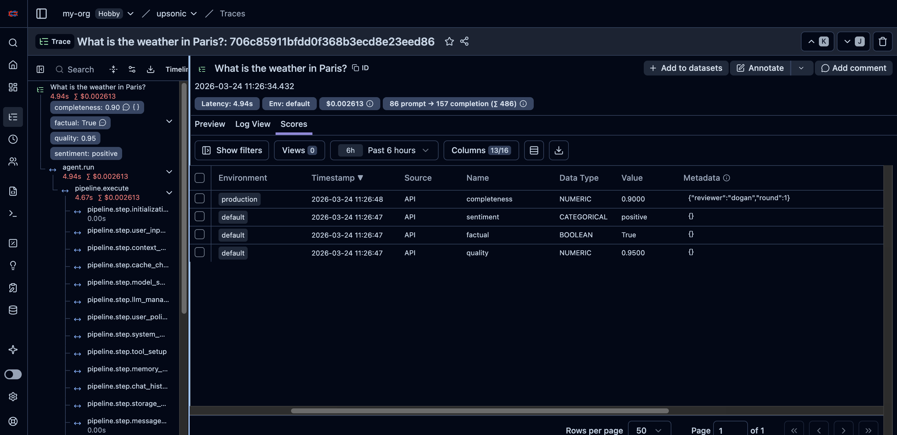

## Scores

Add numeric, boolean, or categorical scores to any trace.

### Create Scores

```python
import os
import time
import uuid
from upsonic import Agent, Task
from upsonic.integrations.langfuse import Langfuse

langfuse = Langfuse()
agent = Agent("anthropic/claude-sonnet-4-6", instrument=langfuse)

# Run the agent and get the trace ID
result = agent.do("What is the weather in Paris?", return_output=True)
trace_id = result.trace_id
time.sleep(8)  # wait for trace ingestion

# Numeric score (0-1)
langfuse.score(trace_id, "quality", 0.95)

# Boolean score
langfuse.score(trace_id, "factual", 1, data_type="BOOLEAN", comment="Correct answer")

# Categorical score
langfuse.score(trace_id, "sentiment", "positive", data_type="CATEGORICAL")

# Score with all parameters
score_id = str(uuid.uuid4())
langfuse.score(
    trace_id,
    "completeness",
    0.9,
    data_type="NUMERIC",
    score_id=score_id,
    metadata={"reviewer": "dogan", "round": 1},
    environment="production",
    comment="Thorough answer",
)

langfuse.shutdown()
```

<Frame>
  
</Frame>

### Upsert a Score

Pass the same `score_id` to update an existing score:

```python
import os
import time
import uuid
from upsonic import Agent, Task
from upsonic.integrations.langfuse import Langfuse

langfuse = Langfuse()
agent = Agent("anthropic/claude-sonnet-4-6", instrument=langfuse)

result = agent.do("What is 2 + 2?", return_output=True)
trace_id = result.trace_id
time.sleep(8)

score_id = str(uuid.uuid4())
langfuse.score(trace_id, "completeness", 0.9, score_id=score_id, comment="First review")

# Update the same score by passing the same score_id
langfuse.score(trace_id, "completeness", 0.75, score_id=score_id, comment="Revised after re-read")

langfuse.shutdown()
```

### Query Scores

```python
import os
import time
from upsonic import Agent, Task
from upsonic.integrations.langfuse import Langfuse

langfuse = Langfuse()
agent = Agent("anthropic/claude-sonnet-4-6", instrument=langfuse)

result = agent.do("Hello!", return_output=True)
trace_id = result.trace_id
time.sleep(8)

langfuse.score(trace_id, "quality", 0.95)
time.sleep(10)  # Langfuse ingestion is eventually consistent; allow enough time before querying by trace_id

# By trace
scores = langfuse.get_scores(trace_id=trace_id)
print(f"Scores for trace: {len(scores['data'])}")

# By name and date
quality_scores = langfuse.get_scores(name="quality", from_timestamp="2026-03-01T00:00:00Z")

# By source and limit
api_scores = langfuse.get_scores(source="API", limit=5)

# By data type
bool_scores = langfuse.get_scores(data_type="BOOLEAN", name="factual")

langfuse.shutdown()
```

### Delete a Score

```python
import os
import time
from upsonic import Agent, Task
from upsonic.integrations.langfuse import Langfuse

langfuse = Langfuse()
agent = Agent("anthropic/claude-sonnet-4-6", instrument=langfuse)

result = agent.do("Hello!", return_output=True)
trace_id = result.trace_id
time.sleep(8)

score = langfuse.score(trace_id, "quality", 0.5)
time.sleep(2)

langfuse.delete_score(score["id"])
print("Score deleted")

langfuse.shutdown()
```

---

## Score Configs

Define validation rules for scores (ranges, categories, descriptions).

### Create and Use Score Configs

```python
import os
import time
from upsonic import Agent, Task
from upsonic.integrations.langfuse import Langfuse

langfuse = Langfuse()
agent = Agent("anthropic/claude-sonnet-4-6", instrument=langfuse)

# Create configs
numeric_config = langfuse.create_score_config(
    "quality", "NUMERIC",
    min_value=0, max_value=1,
    description="Overall quality score between 0 and 1",
)
print(f"Numeric config ID: {numeric_config['id']}")

categorical_config = langfuse.create_score_config(
    "sentiment", "CATEGORICAL",
    categories=[
        {"label": "positive", "value": 1},
        {"label": "neutral", "value": 0},
        {"label": "negative", "value": -1},
    ],
)
print(f"Categorical config ID: {categorical_config['id']}")

boolean_config = langfuse.create_score_config("factual", "BOOLEAN")
print(f"Boolean config ID: {boolean_config['id']}")

# Run agent and score with config validation
result = agent.do("What is 2 + 2?", return_output=True)
trace_id = result.trace_id
time.sleep(8)

validated_score = langfuse.score(trace_id, "quality", 0.8, config_id=numeric_config["id"])
print(f"Validated score: {validated_score}")

langfuse.shutdown()
```


### List, Get, Update Configs

```python
import os
from upsonic.integrations.langfuse import Langfuse

langfuse = Langfuse()

# List all configs
all_configs = langfuse.get_score_configs()
print(f"Total configs: {all_configs['meta']['totalItems']}")

# Get a single config by ID
if all_configs["data"]:
    config_id = all_configs["data"][0]["id"]
    config = langfuse.get_score_config(config_id)
    print(f"Config: {config['name']} ({config['dataType']})")

    # Update config
    updated = langfuse.update_score_config(
        config_id,
        description="Updated description",
    )
    print(f"Updated: {updated['description']}")

    # Archive
    langfuse.update_score_config(config_id, is_archived=True)
    print("Archived")

    # Unarchive
    langfuse.update_score_config(config_id, is_archived=False)
    print("Unarchived")

langfuse.shutdown()
```

---

## Datasets

Create datasets, add items, and link traces via run items.

### Full Dataset Workflow

```python
import os
import time
from upsonic import Agent, Task
from upsonic.integrations.langfuse import Langfuse

langfuse = Langfuse()
agent = Agent("anthropic/claude-sonnet-4-6", instrument=langfuse)

# 1. Create a dataset
langfuse.create_dataset(
    "my-eval-dataset",
    description="Evaluation dataset for math questions",
)

# 2. Add a dataset item
item = langfuse.create_dataset_item(
    "my-eval-dataset",
    input="What is 2 + 2?",
    expected_output="4",
)
print(f"Item ID: {item['id']}")

# 3. Run the agent
result = agent.do("What is 2 + 2?", return_output=True)
trace_id = result.trace_id
time.sleep(10)  # wait for trace ingestion

# 4. Link the trace to the dataset item via a run
langfuse.create_dataset_run_item(
    run_name="eval-run-v1",
    dataset_item_id=item["id"],
    trace_id=trace_id,
    metadata={"generated_output": str(result.output)},
)

# 5. Score the trace
langfuse.score(
    trace_id=trace_id,
    name="accuracy",
    value=10.0,
    data_type="NUMERIC",
    comment="Perfect answer",
)

print(f"Trace {trace_id} linked to dataset item and scored")

langfuse.shutdown()
```

<Frame>
  
</Frame>

<Frame>
  
</Frame>

### List and Get Datasets

```python
import os
from upsonic.integrations.langfuse import Langfuse

langfuse = Langfuse()

# List all datasets
datasets = langfuse.get_datasets()
for ds in datasets["data"]:
    print(f"  {ds['name']}: {ds.get('description', '')}")

# Get a specific dataset
dataset = langfuse.get_dataset("my-eval-dataset")
print(f"Dataset: {dataset['name']}")

# List items in a dataset
items = langfuse.get_dataset_items("my-eval-dataset")
for item in items["data"]:
    print(f"  Input: {item['input']}, Expected: {item['expectedOutput']}")

# List runs
runs = langfuse.get_dataset_runs("my-eval-dataset")
for run in runs["data"]:
    print(f"  Run: {run['name']}")

langfuse.shutdown()
```

### Delete Items and Runs

```python
import os
from upsonic.integrations.langfuse import Langfuse

langfuse = Langfuse()

# Delete a dataset item by ID
langfuse.delete_dataset_item(item_id="<item-id>")

# Delete a dataset run by name
langfuse.delete_dataset_run("my-eval-dataset", "eval-run-v1")

langfuse.shutdown()
```

---

## Annotation Queues

Create review queues, add traces for human review, and track completion.

### Full Annotation Queue Workflow

```python
import os
import time
from upsonic import Agent, Task
from upsonic.integrations.langfuse import Langfuse

langfuse = Langfuse()
agent = Agent("anthropic/claude-sonnet-4-6", instrument=langfuse)

# 1. Create score configs for the queue
numeric_config = langfuse.create_score_config(
    "review-quality", "NUMERIC",
    min_value=0, max_value=10,
    description="Quality score for review",
)

categorical_config = langfuse.create_score_config(
    "review-sentiment", "CATEGORICAL",
    categories=[
        {"label": "positive", "value": 1},
        {"label": "neutral", "value": 0},
        {"label": "negative", "value": -1},
    ],
)

# 2. Create an annotation queue
queue = langfuse.create_annotation_queue(
    "Weekly QA Review",
    score_config_ids=[numeric_config["id"], categorical_config["id"]],
    description="Review agent outputs from this week",
)
print(f"Queue ID: {queue['id']}")

# 3. Run the agent and add traces to the queue
result1 = agent.do("What is the weather in Paris?", return_output=True)
time.sleep(8)

item1 = langfuse.create_annotation_queue_item(
    queue_id=queue["id"],
    object_id=result1.trace_id,
    object_type="TRACE",
)
print(f"Added item 1: {item1['id']}")

result2 = agent.do("What is the weather in Tokyo?", return_output=True)
time.sleep(8)

item2 = langfuse.create_annotation_queue_item(
    queue_id=queue["id"],
    object_id=result2.trace_id,
    object_type="TRACE",
)
print(f"Added item 2: {item2['id']}")

# 4. List pending items
pending = langfuse.get_annotation_queue_items(queue["id"], status="PENDING")
print(f"Pending items: {pending['meta']['totalItems']}")

# 5. Get a specific item
fetched = langfuse.get_annotation_queue_item(queue["id"], item1["id"])
print(f"Item object: {fetched['objectId']}")

# 6. Mark as completed
langfuse.update_annotation_queue_item(queue["id"], item1["id"], status="COMPLETED")

completed = langfuse.get_annotation_queue_items(queue["id"], status="COMPLETED")
print(f"Completed items: {completed['meta']['totalItems']}")

langfuse.shutdown()
```

<Frame>
  
</Frame>

<Frame>
  
</Frame>

### List and Get Queues

```python
import os
from upsonic.integrations.langfuse import Langfuse

langfuse = Langfuse()

# List all queues
all_queues = langfuse.get_annotation_queues()
print(f"Total queues: {all_queues['meta']['totalItems']}")

# Get a specific queue by ID
if all_queues["data"]:
    queue_id = all_queues["data"][0]["id"]
    queue = langfuse.get_annotation_queue(queue_id)
    print(f"Queue: {queue['name']}")

langfuse.shutdown()
```

### Delete Queue Items and Queues

```python
import os
from upsonic.integrations.langfuse import Langfuse

langfuse = Langfuse()

# Delete a queue item
langfuse.delete_annotation_queue_item(queue_id="<queue-id>", item_id="<item-id>")

# Delete an entire queue (clears all items)
langfuse.delete_annotation_queue(queue_id="<queue-id>")

langfuse.shutdown()
```

---

## Update Trace

Override trace output or metadata after the run:

```python
import os
import time
from upsonic import Agent, Task
from upsonic.integrations.langfuse import Langfuse

langfuse = Langfuse()
agent = Agent("anthropic/claude-sonnet-4-6", instrument=langfuse)

result = agent.do("What is 2 + 2?", return_output=True)
trace_id = result.trace_id
time.sleep(8)

langfuse.update_trace(
    trace_id,
    output="Custom output text",
)
print(f"Trace {trace_id} updated")

langfuse.shutdown()
```
