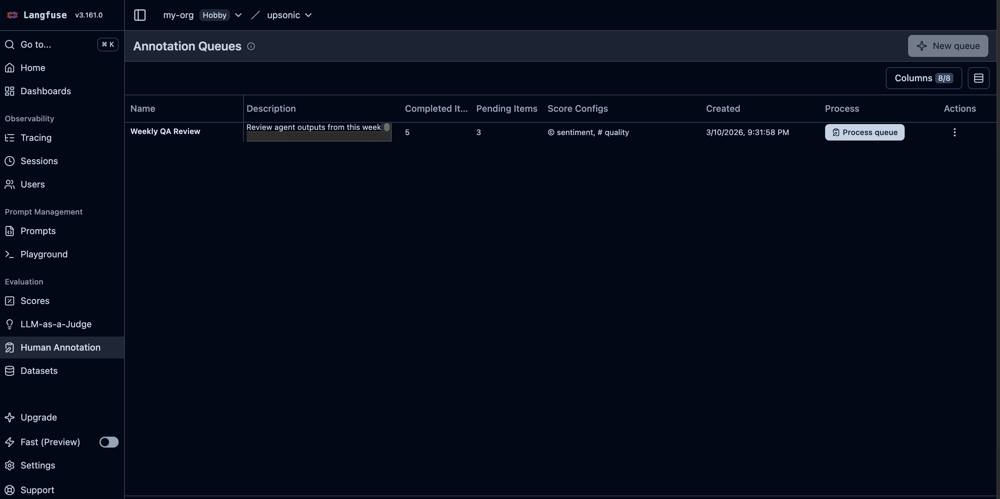
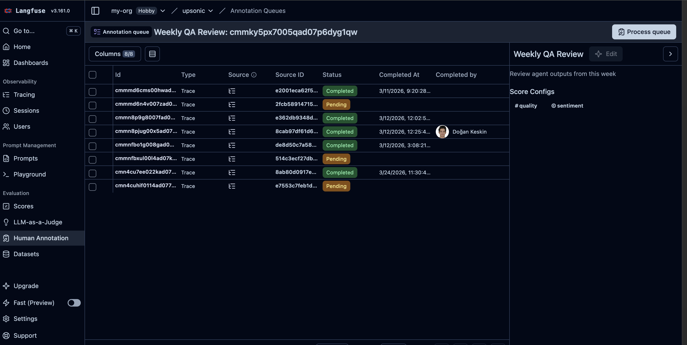

## Annotation Queues

Create review queues, add traces for human review, and track completion.

### Full Annotation Queue Workflow

```python
import os
import time
from upsonic import Agent, Task
from upsonic.integrations.langfuse import Langfuse

langfuse = Langfuse()
agent = Agent("anthropic/claude-sonnet-4-6", instrument=langfuse)

# 1. Create score configs for the queue
numeric_config = langfuse.create_score_config(
    "review-quality", "NUMERIC",
    min_value=0, max_value=10,
    description="Quality score for review",
)

categorical_config = langfuse.create_score_config(
    "review-sentiment", "CATEGORICAL",
    categories=[
        {"label": "positive", "value": 1},
        {"label": "neutral", "value": 0},
        {"label": "negative", "value": -1},
    ],
)

# 2. Create an annotation queue
queue = langfuse.create_annotation_queue(
    "Weekly QA Review",
    score_config_ids=[numeric_config["id"], categorical_config["id"]],
    description="Review agent outputs from this week",
)
print(f"Queue ID: {queue['id']}")

# 3. Run the agent and add traces to the queue
result1 = agent.do("What is the weather in Paris?", return_output=True)
time.sleep(8)

item1 = langfuse.create_annotation_queue_item(
    queue_id=queue["id"],
    object_id=result1.trace_id,
    object_type="TRACE",
)
print(f"Added item 1: {item1['id']}")

result2 = agent.do("What is the weather in Tokyo?", return_output=True)
time.sleep(8)

item2 = langfuse.create_annotation_queue_item(
    queue_id=queue["id"],
    object_id=result2.trace_id,
    object_type="TRACE",
)
print(f"Added item 2: {item2['id']}")

# 4. List pending items
pending = langfuse.get_annotation_queue_items(queue["id"], status="PENDING")
print(f"Pending items: {pending['meta']['totalItems']}")

# 5. Get a specific item
fetched = langfuse.get_annotation_queue_item(queue["id"], item1["id"])
print(f"Item object: {fetched['objectId']}")

# 6. Mark as completed
langfuse.update_annotation_queue_item(queue["id"], item1["id"], status="COMPLETED")

completed = langfuse.get_annotation_queue_items(queue["id"], status="COMPLETED")
print(f"Completed items: {completed['meta']['totalItems']}")

langfuse.shutdown()
```

<Frame caption="Langfuse annotation queues overview">
  
</Frame>

<Frame caption="Langfuse annotation queue item detail">
  
</Frame>

### List and Get Queues

```python
import os
from upsonic.integrations.langfuse import Langfuse

langfuse = Langfuse()

# List all queues
all_queues = langfuse.get_annotation_queues()
print(f"Total queues: {all_queues['meta']['totalItems']}")

# Get a specific queue by ID
if all_queues["data"]:
    queue_id = all_queues["data"][0]["id"]
    queue = langfuse.get_annotation_queue(queue_id)
    print(f"Queue: {queue['name']}")

langfuse.shutdown()
```

### Delete Queue Items and Queues

```python
import os
from upsonic.integrations.langfuse import Langfuse

langfuse = Langfuse()

# Delete a queue item
langfuse.delete_annotation_queue_item(queue_id="<queue-id>", item_id="<item-id>")

# Delete an entire queue (clears all items)
langfuse.delete_annotation_queue(queue_id="<queue-id>")

langfuse.shutdown()
```
