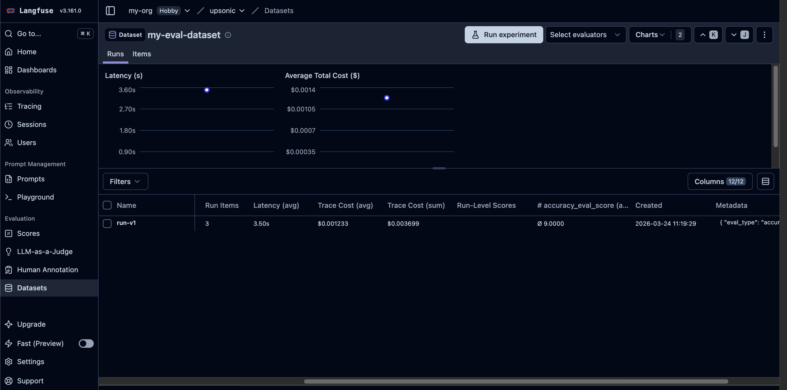
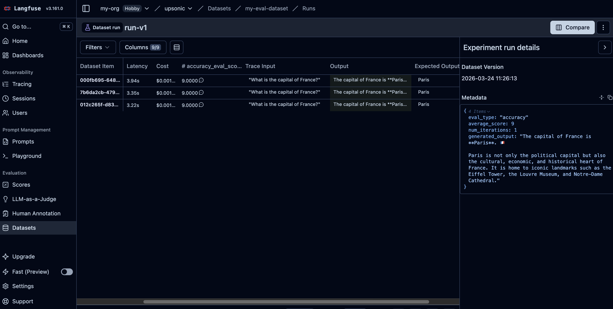

Create datasets, add items, and link traces via run items.

### Full Dataset Workflow

```python
import os
import time
from upsonic import Agent, Task
from upsonic.integrations.langfuse import Langfuse

langfuse = Langfuse()
agent = Agent("anthropic/claude-sonnet-4-6", instrument=langfuse)

# 1. Create a dataset
langfuse.create_dataset(
    "my-eval-dataset",
    description="Evaluation dataset for math questions",
)

# 2. Add a dataset item
item = langfuse.create_dataset_item(
    "my-eval-dataset",
    input="What is 2 + 2?",
    expected_output="4",
)
print(f"Item ID: {item['id']}")

# 3. Run the agent
result = agent.do("What is 2 + 2?", return_output=True)
trace_id = result.trace_id
time.sleep(10)  # wait for trace ingestion

# 4. Link the trace to the dataset item via a run
langfuse.create_dataset_run_item(
    run_name="eval-run-v1",
    dataset_item_id=item["id"],
    trace_id=trace_id,
    metadata={"generated_output": str(result.output)},
)

# 5. Score the trace
langfuse.score(
    trace_id=trace_id,
    name="accuracy",
    value=10.0,
    data_type="NUMERIC",
    comment="Perfect answer",
)

print(f"Trace {trace_id} linked to dataset item and scored")

langfuse.shutdown()
```

<Frame caption="Langfuse datasets overview with items and runs">
  
</Frame>

<Frame caption="Langfuse dataset detail with items and run results">
  
</Frame>

### List and Get Datasets

```python
import os
from upsonic.integrations.langfuse import Langfuse

langfuse = Langfuse()

# List all datasets
datasets = langfuse.get_datasets()
for ds in datasets["data"]:
    print(f"  {ds['name']}: {ds.get('description', '')}")

# Get a specific dataset
dataset = langfuse.get_dataset("my-eval-dataset")
print(f"Dataset: {dataset['name']}")

# List items in a dataset
items = langfuse.get_dataset_items("my-eval-dataset")
for item in items["data"]:
    print(f"  Input: {item['input']}, Expected: {item['expectedOutput']}")

# List runs
runs = langfuse.get_dataset_runs("my-eval-dataset")
for run in runs["data"]:
    print(f"  Run: {run['name']}")

langfuse.shutdown()
```

### Delete Items and Runs

```python
import os
from upsonic.integrations.langfuse import Langfuse

langfuse = Langfuse()

# Delete a dataset item by ID
langfuse.delete_dataset_item(item_id="<item-id>")

# Delete a dataset run by name
langfuse.delete_dataset_run("my-eval-dataset", "eval-run-v1")

langfuse.shutdown()
```
