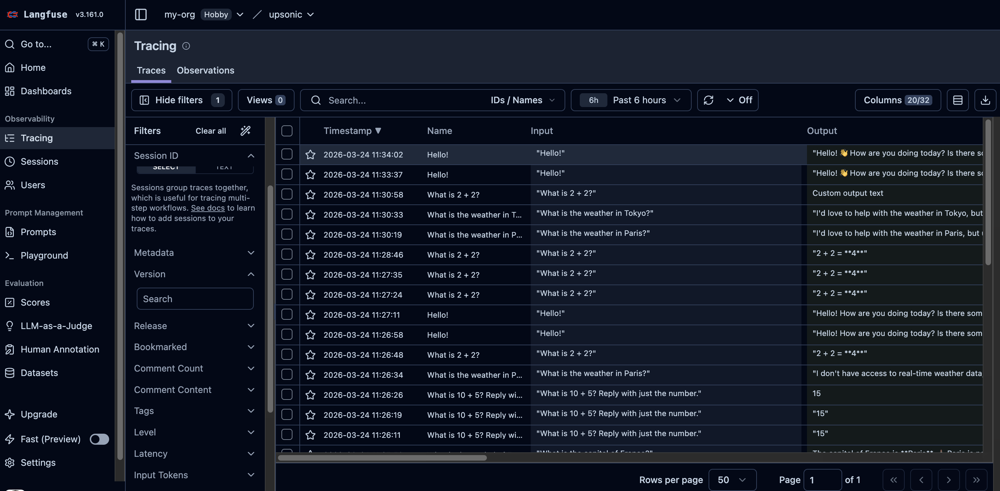
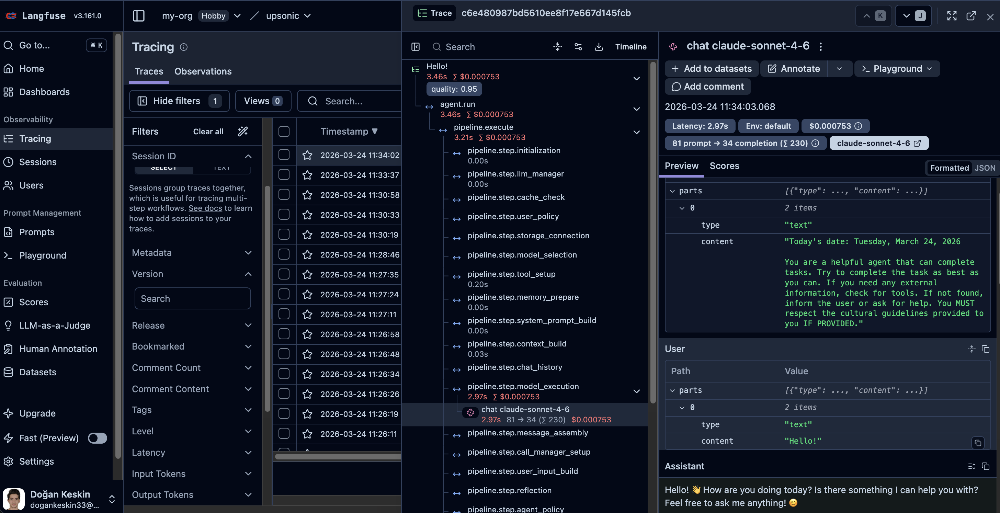
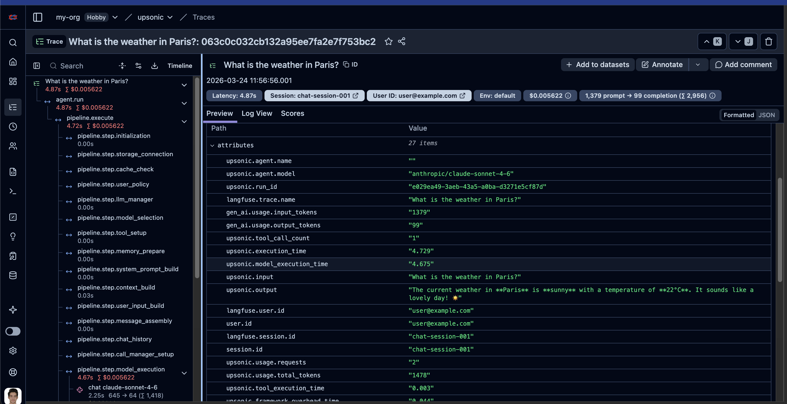
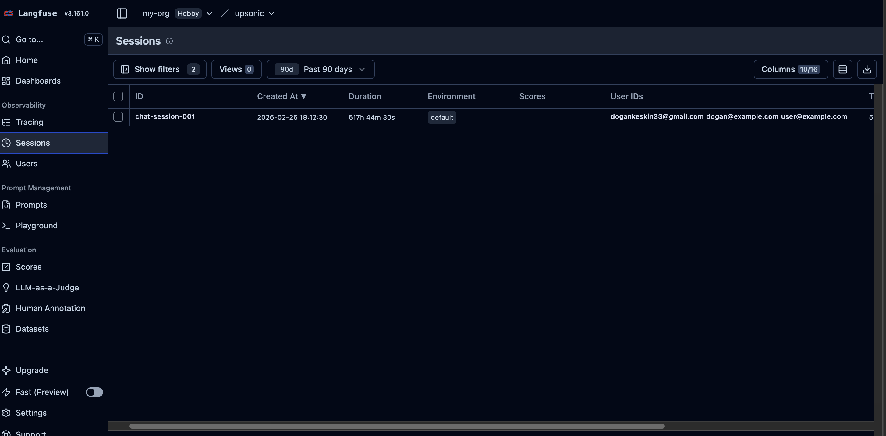
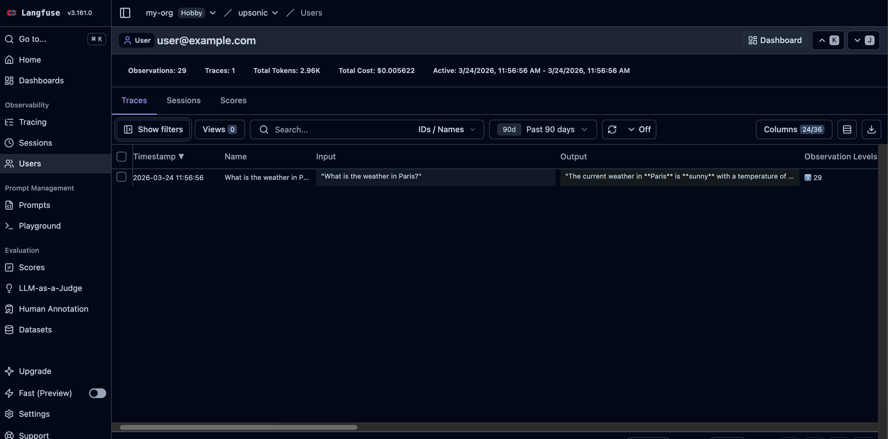
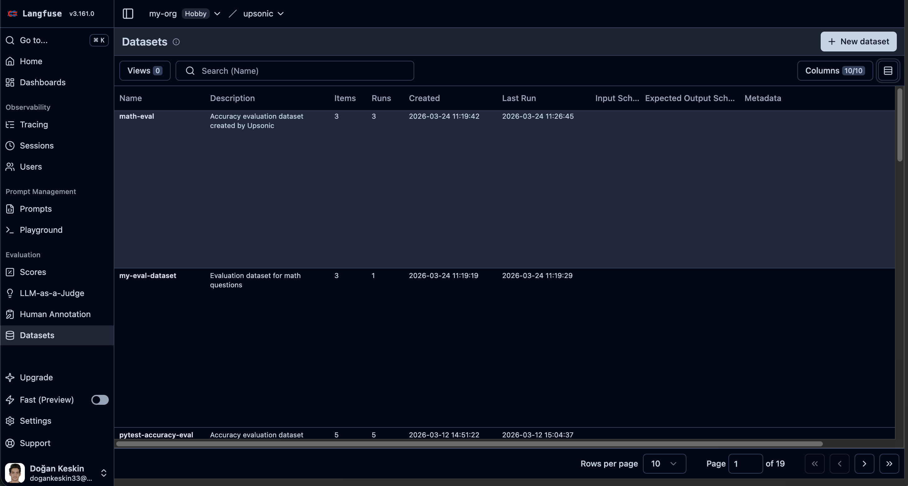
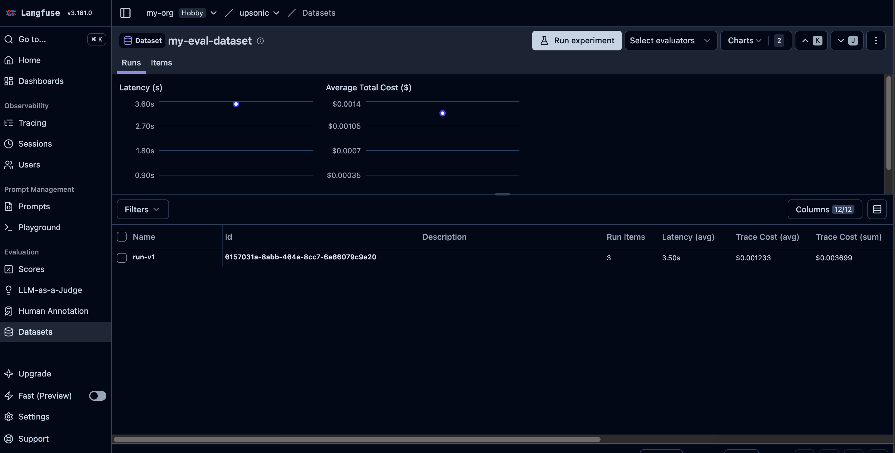
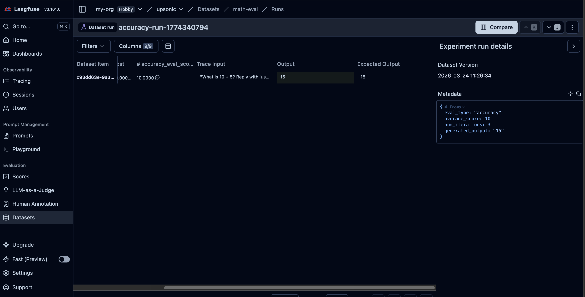
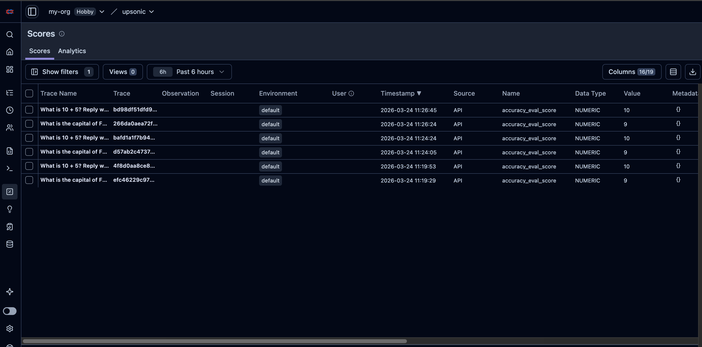

## Setup

Get your keys from the [Langfuse dashboard](https://cloud.langfuse.com) → Settings → API Keys.

```bash
export LANGFUSE_PUBLIC_KEY=pk-lf-...
export LANGFUSE_SECRET_KEY=sk-lf-...
```

<Info>
Install the optional dependencies:

```bash
uv pip install "upsonic[langfuse]"
# pip install "upsonic[langfuse]"
```
</Info>

---

## Usage with Agent / Task

Every `agent.do()` or `agent.print_do()` (including async versions) call is automatically traced to Langfuse when you pass `instrument=langfuse`.

### Minimal — Keys from Environment

<Tabs>
  <Tab title="Agent">
```python
from upsonic import Agent, Task
from upsonic.integrations.langfuse import Langfuse

langfuse = Langfuse()
agent = Agent("anthropic/claude-sonnet-4-6", instrument=langfuse)

task = Task(description="What is 2 + 2?")
agent.print_do(task)

langfuse.shutdown()
```
  </Tab>
  <Tab title="AutonomousAgent">
```python
from upsonic import AutonomousAgent, Task
from upsonic.integrations.langfuse import Langfuse

langfuse = Langfuse()
agent = AutonomousAgent("anthropic/claude-sonnet-4-6", instrument=langfuse)

task = Task(description="What is 2 + 2?")
agent.print_do(task)

langfuse.shutdown()
```
  </Tab>
</Tabs>

<Frame caption="Langfuse trace overview with input, output, and other metrics">
  
</Frame>

<Frame caption="Langfuse trace detail view with spans and metadata">
  
</Frame>

### Full Configuration with Session & User Tracking

<Tabs>
  <Tab title="Agent">
```python
from upsonic import Agent, Task
from upsonic.integrations.langfuse import Langfuse
from upsonic.tools import tool

@tool
def get_weather(city: str) -> str:
    """Get the current weather for a city."""
    return f"Sunny in {city}, 22°C"

langfuse = Langfuse(
    public_key="pk-lf-abc123",
    secret_key="sk-lf-xyz789",
    region="us",                  # "eu" (default) or "us"
    service_name="my-agent",
    include_content=True,         # include prompts/responses (default)
)

agent = Agent(
    "anthropic/claude-sonnet-4-6",
    instrument=langfuse,
    session_id="chat-session-001",
    user_id="user@example.com",
    tools=[get_weather],
)

task = Task(description="What is the weather in Paris?")
agent.print_do(task)

langfuse.shutdown()
```
  </Tab>
  <Tab title="AutonomousAgent">
```python
from upsonic import AutonomousAgent, Task
from upsonic.integrations.langfuse import Langfuse
from upsonic.tools import tool

@tool
def get_weather(city: str) -> str:
    """Get the current weather for a city."""
    return f"Sunny in {city}, 22°C"

langfuse = Langfuse(
    public_key="pk-lf-abc123",
    secret_key="sk-lf-xyz789",
    region="us",                  # "eu" (default) or "us"
    service_name="my-agent",
    include_content=True,         # include prompts/responses (default)
)

agent = AutonomousAgent(
    "anthropic/claude-sonnet-4-6",
    instrument=langfuse,
    session_id="chat-session-001",
    user_id="user@example.com",
    tools=[get_weather],
)

task = Task(description="What is the weather in Paris?")
agent.print_do(task)

langfuse.shutdown()
```
  </Tab>
</Tabs>

<Frame caption="Langfuse trace with tool call spans">
  
</Frame>

<Frame caption="Langfuse session grouping view">
  
</Frame>

<Frame caption="Langfuse user ID tracking on traces">
  
</Frame>

---

## Autonomous Agent Example

Autonomous agents make their own decisions about which tools to call and in what order — there is no predefined workflow. This makes tracing especially important: you need full visibility into every decision the agent made, which tools it invoked, and what results it got back. Langfuse gives you that observability out of the box.

Here is a real-world example — an expense tracker bot that reads receipt images autonomously:

```python
"""
Receipt Tracker — Autonomous Agent Example

Drop receipt images (PNG, JPG) or PDFs into workspace/receipts/ and run this script.
The agent reads each receipt, extracts the expense details, logs them, and reports
your monthly spending summary.
"""

import os
from dotenv import load_dotenv
from upsonic import AutonomousAgent, Task
from upsonic.integrations.langfuse import Langfuse

langfuse = Langfuse()

from tools import ocr_extract_text

load_dotenv()

agent = AutonomousAgent(
    model="anthropic/claude-sonnet-4-6",
    tools=[ocr_extract_text],
    workspace=os.path.join(os.path.dirname(__file__), "workspace"),
    instrument=langfuse,
)

task = Task("Save my receipts from the receipts/ folder and tell me my monthly expenses. DO NOT USE run_python to execute any code. COMMAND! USE BOTH read_file AND ocr_extract_text TOOLS!")

if __name__ == "__main__":
    agent.print_do(task)
    langfuse.shutdown()
```

<Note>
If you want to see the full project with OCR tools, workspace setup, and sample receipts, check out the complete example: [Expense Tracker Bot](/examples/autonomous-agents/expense-tracker-bot).
</Note>

<Frame caption="Langfuse trace overview — full pipeline visibility with input, output, cost, latency, and the agent's expense report">
  
</Frame>

<Frame caption="LLM generation detail — tool availability with called/not-called status for each tool">
  
</Frame>

<Frame caption="Trace timeline — every LLM call, tool execution, token count, and cost breakdown step by step">
  
</Frame>

---

## Usage with Evaluation

### What is AccuracyEvaluator?

`AccuracyEvaluator` measures how well your agent's output matches an expected answer. It uses a separate **judge agent** to score the agent-under-test on a scale of 0–10. You can run multiple iterations for statistical confidence. When connected to Langfuse, each evaluation is automatically logged as a dataset item, linked to the agent's trace, and scored — giving you a complete audit trail of your agent's accuracy over time.

<Note>
For a deep dive into accuracy evaluation concepts, configuration options, and best practices, see the [AccuracyEval Introduction](/concepts/evals/usage/accuracy/introduction).
</Note>

### AccuracyEvaluator with Langfuse Datasets

When you pass `langfuse` to `AccuracyEvaluator`, evaluation results are automatically:
1. Logged as a **dataset item**
2. Linked to the agent's **trace** via a **dataset run item**
3. **Scored** on the trace with the evaluation result

<Tabs>
  <Tab title="Agent">
```python
import asyncio
from upsonic import Agent, Task
from upsonic.integrations.langfuse import Langfuse
from upsonic.eval import AccuracyEvaluator

langfuse = Langfuse()

agent = Agent("anthropic/claude-sonnet-4-6", instrument=langfuse)
judge = Agent("anthropic/claude-sonnet-4-6")

evaluator = AccuracyEvaluator(
    judge_agent=judge,
    agent_under_test=agent,
    query="What is the capital of France?",
    expected_output="Paris",
    langfuse=langfuse,
    langfuse_dataset_name="my-eval-dataset",  # optional, default: "accuracy-eval"
    langfuse_run_name="run-v1",               # optional, default: auto-generated
)

result = asyncio.run(evaluator.run())
print(f"Score: {result.average_score}/10")

langfuse.shutdown()
```
  </Tab>
  <Tab title="AutonomousAgent">
```python
import asyncio
from upsonic import AutonomousAgent, Task
from upsonic.integrations.langfuse import Langfuse
from upsonic.eval import AccuracyEvaluator

langfuse = Langfuse()

agent = AutonomousAgent("anthropic/claude-sonnet-4-6", instrument=langfuse)
judge = AutonomousAgent("anthropic/claude-sonnet-4-6")

evaluator = AccuracyEvaluator(
    judge_agent=judge,
    agent_under_test=agent,
    query="What is the capital of France?",
    expected_output="Paris",
    langfuse=langfuse,
    langfuse_dataset_name="my-eval-dataset",  # optional, default: "accuracy-eval"
    langfuse_run_name="run-v1",               # optional, default: auto-generated
)

result = asyncio.run(evaluator.run())
print(f"Score: {result.average_score}/10")

langfuse.shutdown()
```
  </Tab>
</Tabs>

<Frame caption="Langfuse dataset items and structure">
  
</Frame>

<Frame caption="Langfuse dataset run linked to traces">
  
</Frame>

<Frame caption="Langfuse dataset run results and scores">
  
</Frame>

### AccuracyEvaluator with Multiple Iterations

Run the same query multiple times to get statistical confidence:

<Tabs>
  <Tab title="Agent">
```python
import asyncio
from upsonic import Agent
from upsonic.integrations.langfuse import Langfuse
from upsonic.eval import AccuracyEvaluator

langfuse = Langfuse()
agent = Agent("anthropic/claude-sonnet-4-6", instrument=langfuse)
judge = Agent("anthropic/claude-sonnet-4-6")

evaluator = AccuracyEvaluator(
    judge_agent=judge,
    agent_under_test=agent,
    query="What is 10 + 5? Reply with just the number.",
    expected_output="15",
    num_iterations=3,
    langfuse=langfuse,
    langfuse_dataset_name="math-eval",
)

result = asyncio.run(evaluator.run())
print(f"Average score: {result.average_score}/10")
print(f"Iterations: {len(result.evaluation_scores)}")

langfuse.shutdown()
```
  </Tab>
  <Tab title="AutonomousAgent">
```python
import asyncio
from upsonic import AutonomousAgent
from upsonic.integrations.langfuse import Langfuse
from upsonic.eval import AccuracyEvaluator

langfuse = Langfuse()
agent = AutonomousAgent("anthropic/claude-sonnet-4-6", instrument=langfuse)
judge = AutonomousAgent("anthropic/claude-sonnet-4-6")

evaluator = AccuracyEvaluator(
    judge_agent=judge,
    agent_under_test=agent,
    query="What is 10 + 5? Reply with just the number.",
    expected_output="15",
    num_iterations=3,
    langfuse=langfuse,
    langfuse_dataset_name="math-eval",
)

result = asyncio.run(evaluator.run())
print(f"Average score: {result.average_score}/10")
print(f"Iterations: {len(result.evaluation_scores)}")

langfuse.shutdown()
```
  </Tab>
</Tabs>

<Frame caption="Langfuse trace showing accuracy_eval_score">
  
</Frame>

### AccuracyEvaluator Parameters

| Parameter | Type | Default | Description |
|---|---|---|---|
| `langfuse` | `Langfuse` | `None` | Langfuse instance for dataset logging |
| `langfuse_dataset_name` | `str` | `"accuracy-eval"` | Name of the Langfuse dataset to create/use |
| `langfuse_run_name` | `str` | auto-generated | Name for the dataset run |
| `num_iterations` | `int` | `1` | Number of times to run the evaluation |

---

## Advanced APIs

For direct access to Langfuse's scoring, datasets, and annotation queue APIs, see the Advanced guides:

- [Scores](/concepts/tracing/integrations/langfuse/advanced/scores) — Add numeric, boolean, or categorical scores to traces
- [Score Configs](/concepts/tracing/integrations/langfuse/advanced/score-configs) — Define validation rules for scores
- [Datasets](/concepts/tracing/integrations/langfuse/advanced/datasets) — Create datasets, add items, and link traces
- [Annotation Queues](/concepts/tracing/integrations/langfuse/advanced/annotation-queues) — Create review queues for human evaluation
- [Update Trace](/concepts/tracing/integrations/langfuse/advanced/update-trace) — Override trace output or metadata after a run

---

## `langfuse.shutdown()`

<Info>
**Why call `langfuse.shutdown()`?** Langfuse sends traces via a `BatchSpanProcessor` that buffers spans and exports them every **5 seconds** by default. When you call `langfuse.shutdown()`, it forces all buffered spans to be flushed to Langfuse before shutting down the provider.

By default `flush_on_exit=True` registers a Python `atexit` handler that calls `shutdown()` automatically when the process exits. However, calling it explicitly at the end of your script is recommended for short-lived scripts because `atexit` handlers can be skipped in edge cases (e.g., `SIGKILL`, `os._exit()`).

</Info>

---

## Parameters Reference

| Parameter | Type | Default | Description |
|---|---|---|---|
| `public_key` | `str` | env `LANGFUSE_PUBLIC_KEY` | Langfuse public key |
| `secret_key` | `str` | env `LANGFUSE_SECRET_KEY` | Langfuse secret key |
| `host` | `str` | env `LANGFUSE_HOST` | Custom host URL |
| `region` | `"eu"` \| `"us"` | `"eu"` | Cloud region (ignored if `host` is set) |
| `service_name` | `str` | `"upsonic"` | Service name in traces |
| `sample_rate` | `float` | `1.0` | Fraction of traces to sample (0.0–1.0) |
| `include_content` | `bool` | `True` | Include prompts/responses in traces |
| `flush_on_exit` | `bool` | `True` | Auto-flush on process exit |

## Environment Variables

| Variable | Description |
|---|---|
| `LANGFUSE_PUBLIC_KEY` | Langfuse public key (`pk-lf-...`) |
| `LANGFUSE_SECRET_KEY` | Langfuse secret key (`sk-lf-...`) |
| `LANGFUSE_HOST` | Custom Langfuse host URL |
