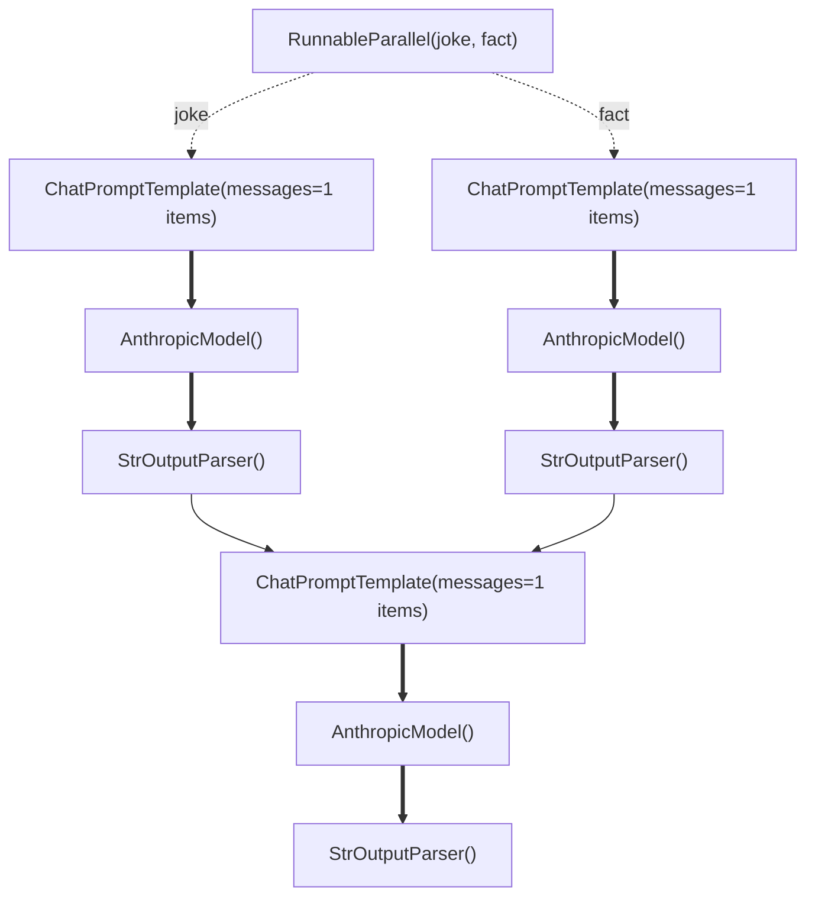

## Overview

UEL provides visualization capabilities to help you understand and debug complex chain structures. You can generate ASCII representations and Mermaid diagrams of your chains.

**Key Features:**
- **Full Chain Display**: ASCII visualization shows complete sequential chains for all parallel branches
- **Branch Labels**: Each node in a parallel branch is labeled with its branch keyword (e.g., `[summary]`, `[sentiment]`)
- **Nested Parallel Support**: Clearly identifies which path belongs to which keyword in nested parallel structures
- **Mermaid Diagrams**: Generate interactive diagrams for complex workflows

## ASCII Visualization

```python
from upsonic.uel import ChatPromptTemplate, StrOutputParser
from upsonic.models import infer_model

# Create a chain
chain = (
    ChatPromptTemplate.from_template("Tell me about {topic}")
    | infer_model("anthropic/claude-sonnet-4-5")
    | StrOutputParser()
)

# Get ASCII representation
graph = chain.get_graph()
graph.print_ascii()
```

Output:
```
ChatPromptTemplate(messages=1 items)
  |
  v
AnthropicModel()
  |
  v
StrOutputParser()
```

## Complex Chain Visualization

```python
from upsonic.uel import ChatPromptTemplate, RunnableParallel, RunnableLambda, StrOutputParser
from upsonic.models import infer_model

model = infer_model("anthropic/claude-sonnet-4-5")
parser = StrOutputParser()

# Create a complex chain
chain = (
    {
        "joke": ChatPromptTemplate.from_template("Joke about {topic}") | model | parser,
        "fact": ChatPromptTemplate.from_template("Fact about {topic}") | model | parser
    }
    | ChatPromptTemplate.from_template("Combine:\nJoke: {joke}\nFact: {fact}")
    | model
    | parser
)

# Visualize
graph = chain.get_graph()
graph.print_ascii()
```

Output:
```
RunnableParallel(joke, fact)
  ├─> [joke] ChatPromptTemplate(messages=1 items)
    |
    v
    [joke] AnthropicModel()
    |
    v
    [joke] StrOutputParser()
  └─> [fact] ChatPromptTemplate(messages=1 items)
    |
    v
    [fact] AnthropicModel()
    |
    v
    [fact] StrOutputParser()
  |
  v
ChatPromptTemplate(messages=1 items)
  |
  v
AnthropicModel()
  |
  v
StrOutputParser()
```

**Note:** The ASCII visualization shows complete sequential chains for each parallel branch with branch labels (e.g., `[joke]`, `[fact]`) to clearly identify which path belongs to which branch.

## Mermaid Diagrams

```python
from upsonic.uel import ChatPromptTemplate, RunnableParallel, StrOutputParser
from upsonic.models import infer_model

model = infer_model("anthropic/claude-sonnet-4-5")
parser = StrOutputParser()

# Create a complex chain
chain = (
    {
        "joke": ChatPromptTemplate.from_template("Joke about {topic}") | model | parser,
        "fact": ChatPromptTemplate.from_template("Fact about {topic}") | model | parser
    }
    | ChatPromptTemplate.from_template("Combine:\nJoke: {joke}\nFact: {fact}")
    | model
    | parser
)

# Generate Mermaid diagram
mermaid_code = chain.get_graph().to_mermaid()
print(mermaid_code)
```

Output:


## Visualizing Custom Chains

```python
from upsonic.uel import chain as chain_decorator, ChatPromptTemplate, StrOutputParser
from upsonic.models import infer_model

# Note: @chain decorated functions don't have get_graph() method
# To visualize, build the chain explicitly instead
model = infer_model("anthropic/claude-sonnet-4-5")
parser = StrOutputParser()

# Build chain explicitly for visualization
visualization_chain = (
    ChatPromptTemplate.from_template("Step 1: {input}")
    | model
    | parser
    | ChatPromptTemplate.from_template("Step 2: {input}")
    | model
    | parser
)

# Visualize the chain
graph = visualization_chain.get_graph()
graph.print_ascii()

# Or use @chain for custom logic, but visualize the returned chain
@chain_decorator
def custom_chain(input_dict):
    model = infer_model("anthropic/claude-sonnet-4-5")
    parser = StrOutputParser()
    prompt1 = ChatPromptTemplate.from_template("Step 1: {input}")
    prompt2 = ChatPromptTemplate.from_template("Step 2: {input}")
    
    result1 = (prompt1 | model | parser).invoke(input_dict)
    result2 = (prompt2 | model | parser).invoke({"input": result1})
    
    return result2

# Execute the custom chain
result = custom_chain.invoke({"input": "test"})
print(result)
```

## Exporting Visualizations

```python
from upsonic.uel import ChatPromptTemplate, StrOutputParser
from upsonic.models import infer_model

# Create a chain
chain = (
    ChatPromptTemplate.from_template("Tell me about {topic}")
    | infer_model("anthropic/claude-sonnet-4-5")
    | StrOutputParser()
)

# Save Mermaid diagram to file
mermaid_code = chain.get_graph().to_mermaid()

with open("chain_diagram.mmd", "w") as f:
    f.write(mermaid_code)

print("Diagram saved to chain_diagram.mmd")
```

## Debugging with Visualization

```python
from upsonic.uel import ChatPromptTemplate, StrOutputParser
from upsonic.models import infer_model

# Visualize before execution to understand flow
chain = (
    ChatPromptTemplate.from_template("Process: {input}")
    | infer_model("anthropic/claude-sonnet-4-5")
    | StrOutputParser()
)

# Print structure
print("Chain structure:")
chain.get_graph().print_ascii()

# Then execute
result = chain.invoke({"input": "test"})
print(f"\nResult: {result}")
```

