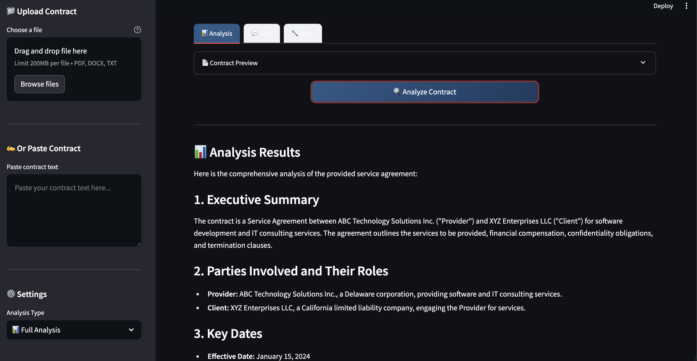

This example demonstrates how to build a comprehensive **Contract Analyzer Agent** using Upsonic's advanced features including custom ToolKits, KnowledgeBase integration, and session Memory.

## Overview

The Contract Analyzer Agent is a production-ready example that showcases:

1. **Custom ToolKit** — Specialized tools for extracting parties, dates, financial terms, and risks from contracts
2. **KnowledgeBase Integration** — Legal reference information available as a searchable tool
3. **Session Memory** — Conversation continuity with in-memory storage
4. **Configurable Settings** — Dataclass-based configuration for easy customization
5. **Multiple Analysis Types** — Full, summary, risk, extraction, and Q&A modes

## Key Features

- **Structured Data Extraction**: Extract parties, dates, financial terms, and obligations with pattern matching
- **Risk Assessment**: Automatically identify high, medium, and low risk clauses
- **Executive Summaries**: Generate quick overviews for business decision-makers
- **Legal Knowledge Base**: Built-in legal terminology and clause reference information
- **API & Streamlit UI**: Run as FastAPI server or interactive Streamlit app

## Project Structure

```
contract_analyzer/
├── README.md
├── main.py                          # API entrypoint
├── upsonic_configs.json             # Upsonic CLI configuration
├── streamlit_app.py                 # Streamlit UI
├── contract_analyzer/
│   ├── __init__.py                  # Package exports
│   ├── agent.py                     # Agent creation and task functions
│   ├── config.py                    # Configuration dataclass
│   ├── tools/
│   │   ├── __init__.py
│   │   └── analysis_toolkit.py      # Custom ToolKit with 6 tools
│   └── knowledge/
│       ├── __init__.py
│       └── legal_kb.py              # KnowledgeBase creation
└── data/                            # Sample contracts and vector DB
```

## Installation

```bash
# Install dependencies
upsonic install

# Or install all sections
upsonic install all
```

### Managing Dependencies

```bash
# Add a package
upsonic add <package> <section>
upsonic add requests api

# Remove a package
upsonic remove <package> <section>
upsonic remove requests api
```

**Sections:** `api`, `streamlit`, `development`

## Usage

### Option 1: Run as API Server

```bash
upsonic run
```

Server starts at `http://localhost:8000`. API documentation at `/docs`.

**Example API call:**
```bash
curl -X POST http://localhost:8000/call \
  -H "Content-Type: application/json" \
  -d '{
    "contract_text": "This Agreement is entered into between ACME Corp and...",
    "analysis_type": "full"
  }'
```

### Option 2: Run Streamlit UI

```bash
streamlit run streamlit_app.py
```

## Analysis Types

| Type | Description |
|------|-------------|
| `full` | Complete analysis with all extracted data |
| `summary` | Executive summary for quick review |
| `risk` | Risk assessment with recommendations |
| `extraction` | Structured data extraction only |
| `qa` | Answer specific questions about the contract |

## Example Output

### Streamlit UI



### Sample Analysis Result

```
📋 Contract Analysis Results

## 1. Executive Summary
This Software as a Service (SaaS) Agreement establishes a binding contract between
TechCorp Solutions Inc. (Provider) and GlobalRetail Enterprises LLC (Client) for 
cloud-based inventory management solutions over a 3-year term.

## 2. Parties Identified
• TechCorp Solutions Inc. (Provider) - Corporation
• GlobalRetail Enterprises LLC (Client) - LLC

## 3. Key Dates
• Effective Date: January 1, 2024
• Term: 3 years
• Auto-Renewal: Yes (with 90-day cancellation notice)

## 4. Financial Terms
• Annual License Fee: $150,000
• Implementation Fee: $25,000 (one-time)
• Late Payment Penalty: 1.5% per month

## 5. Risk Assessment

⚠️ Overall Risk Level: Medium

| Risk Type | Level | Recommendation |
|-----------|-------|----------------|
| Indemnification | Medium | Review scope and ensure mutual coverage |
| Auto-Renewal | Low | Note 90-day cancellation deadline |
| Jurisdiction | Low | Delaware laws are generally favorable |
| Mandatory Arbitration | Medium | Review arbitration terms and venue |

### Recommendations:
- Review indemnification scope to ensure mutual protection
- Calendar the auto-renewal cancellation deadline
- Evaluate arbitration terms and venue adequacy
```

## Complete Implementation

### main.py

```python
from typing import Dict, Any

from contract_analyzer.agent import analyze_contract_async
from upsonic import Task


async def main(inputs: Dict[str, Any]) -> Dict[str, Any]:
    """
    Main API endpoint for contract analysis.
    
    Args:
        inputs: Dictionary containing:
            - contract_text (str, required): The contract text to analyze
            - analysis_type (str, optional): Type of analysis - "full", "summary", "risk", or "extraction". Defaults to "full"
            - session_id (str, optional): Session ID for conversation continuity
            - question (str, optional): Specific question to ask about the contract (for Q&A mode)
    
    Returns:
        Dictionary containing:
            - analysis_result (str): The analysis result
            - analysis_type (str): The type of analysis performed
    """
    contract_text = inputs.get("contract_text")
    analysis_type = inputs.get("analysis_type", "full")
    session_id = inputs.get("session_id")
    question = inputs.get("question")
    
    if not contract_text:
        return {
            "error": "contract_text is required",
            "analysis_result": None
        }
    
    try:
        if question:
            from contract_analyzer.agent import create_contract_analyzer_agent
            
            agent = create_contract_analyzer_agent(session_id=session_id)
            task = Task(
                description=f"""Based on the following contract, please answer this question:

                        Question: {question}

                        <contract>
                        {contract_text}
                        </contract>

                        Provide a helpful, accurate answer based on the contract content."""
            )
            result = await agent.do_async(task)
            return {
                "analysis_result": str(result),
                "analysis_type": "qa"
            }
        
        result = await analyze_contract_async(
            contract_text=contract_text,
            analysis_type=analysis_type,
            session_id=session_id
        )
        
        return {
            "analysis_result": result,
            "analysis_type": analysis_type
        }
        
    except Exception as e:
        return {
            "error": str(e),
            "analysis_result": None,
            "analysis_type": analysis_type
        }
```

### contract_analyzer/config.py

```python
import os
from dataclasses import dataclass, field
from pathlib import Path
from typing import Optional


@dataclass
class ContractAnalyzerConfig:
    """Configuration for the Contract Analyzer Agent."""
    
    model: str = field(default_factory=lambda: os.getenv("CONTRACT_ANALYZER_MODEL", "openai/gpt-4o"))
    
    debug: bool = field(default_factory=lambda: os.getenv("DEBUG", "false").lower() == "true")
    
    vectordb_path: str = field(default_factory=lambda: os.getenv(
        "VECTORDB_PATH", 
        str(Path(__file__).parent.parent / "data" / "vectordb")
    ))
    collection_name: str = "legal_knowledge"
    vector_size: int = 1536
    
    knowledge_sources_dir: Path = field(default_factory=lambda: Path(__file__).parent.parent / "data" / "legal_templates")
    
    agent_name: str = "Contract Analyzer"
    agent_role: str = "Senior Legal Analyst"
    agent_goal: str = "Analyze contracts accurately to extract key information and identify risks"
    
    system_prompt: str = """You are an expert legal contract analyst with extensive experience in reviewing 
and analyzing legal documents. Your role is to:

1. Carefully analyze contract documents provided by users
2. Extract key information such as parties, dates, financial terms, and obligations
3. Identify potential risks, unusual clauses, or areas of concern
4. Provide clear, actionable insights for business decision-makers
5. Search the legal knowledge base when you need reference information about standard contract clauses or legal terminology

When analyzing contracts:
- Be thorough but concise in your responses
- Highlight important findings clearly
- Flag any red flags or areas requiring legal review
- Use the available tools to extract structured information
- Search the knowledge base for relevant legal references when needed

Remember: You are providing analysis to help users understand contracts, but always recommend 
professional legal counsel for final decisions on legal matters."""

    session_id_prefix: str = "contract_analyzer"
    
    def get_session_id(self, user_session: Optional[str] = None) -> str:
        """Generate a session ID for memory."""
        if user_session:
            return f"{self.session_id_prefix}_{user_session}"
        return f"{self.session_id_prefix}_default"


default_config = ContractAnalyzerConfig()
```

### contract_analyzer/agent.py

```python
from typing import Optional, List, Any

from upsonic import Agent, Task
from upsonic.storage.memory import Memory
from upsonic.storage import InMemoryStorage

from contract_analyzer.config import ContractAnalyzerConfig, default_config
from contract_analyzer.tools import ContractAnalyzerToolKit
from contract_analyzer.knowledge import create_legal_knowledge_base


def create_contract_analyzer_agent(
    config: Optional[ContractAnalyzerConfig] = None,
    session_id: Optional[str] = None,
    include_knowledge_base: bool = True,
    additional_tools: Optional[List[Any]] = None
) -> Agent:
    """
    Create a fully configured Contract Analyzer Agent.
    
    The agent is equipped with:
    - ContractAnalyzerToolKit for contract extraction and analysis
    - Legal KnowledgeBase for reference information (as a tool)
    - Session memory for conversation continuity
    - Specialized system prompt for legal analysis
    
    Args:
        config: Configuration settings. Uses default_config if not provided.
        session_id: Session ID for memory. Auto-generated if not provided.
        include_knowledge_base: Whether to include legal KB as a tool (default True).
        additional_tools: Extra tools to add to the agent.
        
    Returns:
        A configured Agent instance ready for contract analysis.
        
    Usage:
        ```python
        agent = create_contract_analyzer_agent()
        
        result = agent.do(Task(
            description="Analyze this contract: [contract text here]"
        ))
        ```
    """
    if config is None:
        config = default_config
    
    session = config.get_session_id(session_id)
    memory = Memory(
        storage=InMemoryStorage(),
        session_id=session,
        full_session_memory=True
    )
    
    tools: List[Any] = []
    
    contract_toolkit = ContractAnalyzerToolKit()
    tools.append(contract_toolkit)
    
    if include_knowledge_base:
        kb = create_legal_knowledge_base(config)
        tools.append(kb)
    
    if additional_tools:
        tools.extend(additional_tools)
    
    agent = Agent(
        model=config.model,
        name=config.agent_name,
        role=config.agent_role,
        goal=config.agent_goal,
        system_prompt=config.system_prompt,
        memory=memory,
        tools=tools,
        debug=config.debug,
        show_tool_calls=True
    )
    
    return agent


def create_analysis_task(
    contract_text: str,
    analysis_type: str = "full",
    specific_questions: Optional[List[str]] = None
) -> Task:
    """
    Create a task for contract analysis.
    
    Args:
        contract_text: The contract text to analyze.
        analysis_type: Type of analysis:
            - "full": Complete contract analysis
            - "summary": Executive summary only
            - "risk": Risk assessment focus
            - "extraction": Data extraction only
            - "custom": Custom questions
        specific_questions: Questions for "custom" analysis type.
        
    Returns:
        A configured Task for the analysis.
    """
    if analysis_type == "full":
        description = f"""Perform a comprehensive analysis of the following contract:

<contract>
{contract_text}
</contract>

Please provide:
1. Executive summary of the contract
2. All parties involved and their roles
3. Key dates (effective, termination, renewal)
4. Financial terms and payment obligations
5. Main obligations for each party
6. Risk assessment with recommendations

If you need reference information about standard contract clauses or legal terminology, 
use the search tool to query the legal knowledge base."""

    elif analysis_type == "summary":
        description = f"""Provide an executive summary of the following contract:

<contract>
{contract_text}
</contract>

Focus on the key points a business executive would need to know for a quick review."""

    elif analysis_type == "risk":
        description = f"""Perform a risk assessment of the following contract:

<contract>
{contract_text}
</contract>

Identify:
1. High-risk clauses requiring immediate attention
2. Medium-risk items to review
3. Unusual or non-standard terms
4. Missing protective clauses
5. Recommendations for negotiation

Use the legal knowledge base to reference standard risk indicators if needed."""

    elif analysis_type == "extraction":
        description = f"""Extract structured data from the following contract:

<contract>
{contract_text}
</contract>

Extract and organize:
1. All parties (names, roles, entity types)
2. All dates mentioned
3. All financial terms and amounts
4. All obligations for each party

Present the information in a structured format."""

    elif analysis_type == "custom" and specific_questions:
        questions_formatted = "\n".join(f"- {q}" for q in specific_questions)
        description = f"""Analyze the following contract to answer these specific questions:

{questions_formatted}

<contract>
{contract_text}
</contract>

Provide detailed answers to each question."""

    else:
        description = f"""Analyze the following contract:

<contract>
{contract_text}
</contract>

Provide a helpful analysis based on the content."""

    return Task(description=description)


async def analyze_contract_async(
    contract_text: str,
    analysis_type: str = "full",
    config: Optional[ContractAnalyzerConfig] = None,
    session_id: Optional[str] = None
) -> str:
    """
    Analyze a contract asynchronously.
    
    Convenience function that creates an agent and task, runs the analysis,
    and returns the result.
    
    Args:
        contract_text: The contract text to analyze.
        analysis_type: Type of analysis ("full", "summary", "risk", "extraction").
        config: Optional configuration settings.
        session_id: Optional session ID for memory continuity.
        
    Returns:
        The analysis result as a string.
    """
    agent = create_contract_analyzer_agent(config=config, session_id=session_id)
    task = create_analysis_task(contract_text, analysis_type)
    
    result = await agent.do_async(task)
    return str(result)


def analyze_contract(
    contract_text: str,
    analysis_type: str = "full",
    config: Optional[ContractAnalyzerConfig] = None,
    session_id: Optional[str] = None
) -> str:
    """
    Analyze a contract synchronously.
    
    Convenience function that creates an agent and task, runs the analysis,
    and returns the result.
    
    Args:
        contract_text: The contract text to analyze.
        analysis_type: Type of analysis ("full", "summary", "risk", "extraction").
        config: Optional configuration settings.
        session_id: Optional session ID for memory continuity.
        
    Returns:
        The analysis result as a string.
    """
    agent = create_contract_analyzer_agent(config=config, session_id=session_id)
    task = create_analysis_task(contract_text, analysis_type)
    
    result = agent.do(task)
    return str(result)
```

### contract_analyzer/tools/analysis_toolkit.py

```python
import re
from typing import Dict, List, Any, Optional
from pydantic import BaseModel, Field

from upsonic.tools import ToolKit, tool


class PartyInfo(BaseModel):
    """Information about a party in a contract."""
    name: str = Field(description="Name of the party")
    role: str = Field(description="Role in the contract (e.g., 'Provider', 'Client', 'Landlord', 'Tenant')")
    type: str = Field(description="Type of entity (e.g., 'Corporation', 'Individual', 'LLC')")


class DateInfo(BaseModel):
    """Date information extracted from a contract."""
    date_type: str = Field(description="Type of date (e.g., 'Effective Date', 'Termination Date', 'Renewal Date')")
    date_value: str = Field(description="The date value")
    description: Optional[str] = Field(default=None, description="Additional context about the date")


class FinancialTerm(BaseModel):
    """Financial term extracted from a contract."""
    term_type: str = Field(description="Type of financial term (e.g., 'Payment', 'Fee', 'Penalty')")
    amount: str = Field(description="The monetary amount or calculation method")
    frequency: Optional[str] = Field(default=None, description="Payment frequency if applicable")
    conditions: Optional[str] = Field(default=None, description="Conditions attached to this term")


class Obligation(BaseModel):
    """An obligation identified in the contract."""
    party: str = Field(description="The party responsible for this obligation")
    description: str = Field(description="Description of the obligation")
    deadline: Optional[str] = Field(default=None, description="Deadline if specified")
    category: str = Field(description="Category (e.g., 'Delivery', 'Payment', 'Confidentiality')")


class RiskClause(BaseModel):
    """A potentially risky clause identified in the contract."""
    clause_type: str = Field(description="Type of clause (e.g., 'Indemnification', 'Limitation of Liability')")
    risk_level: str = Field(description="Risk level: 'Low', 'Medium', 'High'")
    description: str = Field(description="Description of the risk")
    recommendation: str = Field(description="Recommended action or consideration")
    original_text: Optional[str] = Field(default=None, description="The original clause text if identifiable")


class ContractAnalyzerToolKit(ToolKit):
    """
    A toolkit for comprehensive contract analysis.
    
    Provides specialized tools for extracting structured information from 
    legal contracts including parties, dates, financial terms, obligations,
    and risk assessment.
    """
    
    def __init__(self) -> None:
        """Initialize the Contract Analyzer ToolKit."""
        super().__init__()
    
    @tool
    def extract_parties(self, contract_text: str) -> Dict[str, Any]:
        """
        Extract all parties involved in the contract.
        
        Identifies and categorizes all parties mentioned in the contract,
        including their roles and entity types.
        
        Args:
            contract_text: The full text of the contract to analyze.
        
        Returns:
            A dictionary containing:
                - parties: List of party information with name, role, and type
                - total_count: Number of parties identified
                - primary_parties: The main parties to the agreement
        """
        party_patterns = [
            r'(?:between|among)\s+([^(]+?)\s*\(["\']?(\w+)["\']?\)',
            r'(?:hereinafter|referred to as)\s*["\'](\w+)["\']',
            r'"([^"]+)"\s*(?:as|hereinafter referred to as)\s*["\']?(\w+)',
        ]
        
        parties: List[Dict[str, str]] = []
        
        for pattern in party_patterns:
            matches = re.findall(pattern, contract_text, re.IGNORECASE)
            for match in matches:
                if isinstance(match, tuple) and len(match) >= 2:
                    name = match[0].strip()
                    role = match[1].strip()
                    
                    entity_type = "Unknown"
                    if any(term in name.upper() for term in ["CORP", "INC", "LLC", "LTD", "COMPANY"]):
                        entity_type = "Corporation"
                    elif any(term in name.upper() for term in ["PARTNER", "LLP"]):
                        entity_type = "Partnership"
                    else:
                        entity_type = "Individual or Other"
                    
                    parties.append({
                        "name": name,
                        "role": role,
                        "type": entity_type
                    })
        
        seen_names: set = set()
        unique_parties: List[Dict[str, str]] = []
        for party in parties:
            if party["name"].lower() not in seen_names:
                seen_names.add(party["name"].lower())
                unique_parties.append(party)
        
        return {
            "parties": unique_parties,
            "total_count": len(unique_parties),
            "primary_parties": unique_parties[:2] if len(unique_parties) >= 2 else unique_parties,
            "analysis_note": "Parties extracted using pattern matching. Please verify for accuracy."
        }
    
    @tool
    def extract_key_dates(self, contract_text: str) -> Dict[str, Any]:
        """
        Extract important dates from the contract.
        
        Identifies effective dates, termination dates, renewal dates,
        and other significant dates mentioned in the contract.
        
        Args:
            contract_text: The full text of the contract to analyze.
        
        Returns:
            A dictionary containing:
                - dates: List of dates with type, value, and context
                - has_auto_renewal: Whether auto-renewal is mentioned
                - term_info: Basic term/duration information
        """
        dates: List[Dict[str, Any]] = []
        
        date_pattern = r'\b(?:January|February|March|April|May|June|July|August|September|October|November|December)\s+\d{1,2},?\s+\d{4}\b|\b\d{1,2}/\d{1,2}/\d{2,4}\b|\b\d{4}-\d{2}-\d{2}\b'
        
        date_types = {
            "effective": r'(?:effective\s+(?:date|as of)|commencing\s+on|starting)\s*[:\s]*',
            "termination": r'(?:termin\w+\s+date|ends?\s+on|expir\w+\s+(?:date|on))\s*[:\s]*',
            "renewal": r'(?:renew\w+\s+date|renew\w+\s+on)\s*[:\s]*',
            "execution": r'(?:executed\s+(?:on|as of)|signed\s+on)\s*[:\s]*',
            "payment_due": r'(?:payment\s+due|due\s+date)\s*[:\s]*',
        }
        
        for date_type, pattern in date_types.items():
            combined_pattern = pattern + r'(' + date_pattern + r')'
            matches = re.findall(combined_pattern, contract_text, re.IGNORECASE)
            for match in matches:
                dates.append({
                    "date_type": date_type.replace("_", " ").title(),
                    "date_value": match.strip() if isinstance(match, str) else match,
                    "description": f"Found in context of {date_type}"
                })
        
        has_auto_renewal = bool(re.search(r'auto[- ]?renew|automatic\w*\s+renew', contract_text, re.IGNORECASE))
        
        term_match = re.search(r'(?:term|period)\s+of\s+(\d+)\s*(year|month|day)s?', contract_text, re.IGNORECASE)
        term_info = None
        if term_match:
            term_info = f"{term_match.group(1)} {term_match.group(2)}(s)"
        
        return {
            "dates": dates,
            "total_dates_found": len(dates),
            "has_auto_renewal": has_auto_renewal,
            "term_info": term_info,
            "analysis_note": "Date extraction based on common contract patterns."
        }
    
    @tool
    def extract_financial_terms(self, contract_text: str) -> Dict[str, Any]:
        """
        Extract payment terms, amounts, and financial obligations.
        
        Identifies monetary values, payment schedules, fees, penalties,
        and other financial provisions in the contract.
        
        Args:
            contract_text: The full text of the contract to analyze.
        
        Returns:
            A dictionary containing:
                - financial_terms: List of financial provisions found
                - total_value_estimate: Estimated total contract value if determinable
                - payment_structure: Overview of payment arrangements
        """
        financial_terms: List[Dict[str, Any]] = []
        
        currency_pattern = r'\$[\d,]+(?:\.\d{2})?|\b(?:USD|EUR|GBP)\s*[\d,]+(?:\.\d{2})?'
        
        text_lower = contract_text.lower()
        
        term_patterns = {
            "payment": r'(?:payment|pay)\s+(?:of\s+)?(' + currency_pattern + r')',
            "fee": r'(?:fee|fees)\s+(?:of\s+)?(' + currency_pattern + r')',
            "price": r'(?:price|cost|amount)\s+(?:of\s+)?(' + currency_pattern + r')',
            "penalty": r'(?:penalty|penalt(?:y|ies)|late fee)\s+(?:of\s+)?(' + currency_pattern + r')',
            "deposit": r'(?:deposit)\s+(?:of\s+)?(' + currency_pattern + r')',
        }
        
        for term_type, pattern in term_patterns.items():
            matches = re.findall(pattern, contract_text, re.IGNORECASE)
            for match in matches:
                financial_terms.append({
                    "term_type": term_type.title(),
                    "amount": match,
                    "frequency": self._detect_frequency(contract_text, match),
                    "conditions": None
                })
        
        payment_structure = []
        if re.search(r'\bmonthly\b', text_lower):
            payment_structure.append("Monthly payments mentioned")
        if re.search(r'\bquarterly\b', text_lower):
            payment_structure.append("Quarterly payments mentioned")
        if re.search(r'\bannual(?:ly)?\b', text_lower):
            payment_structure.append("Annual payments mentioned")
        if re.search(r'\bone[- ]time\b', text_lower):
            payment_structure.append("One-time payment mentioned")
        
        return {
            "financial_terms": financial_terms,
            "total_terms_found": len(financial_terms),
            "payment_structure": payment_structure if payment_structure else ["Payment structure not clearly identified"],
            "analysis_note": "Financial terms extracted using pattern matching. Verify amounts and terms."
        }
    
    def _detect_frequency(self, text: str, amount: str) -> Optional[str]:
        """Detect payment frequency near an amount."""
        amount_pos = text.find(amount)
        if amount_pos == -1:
            return None
        
        context = text[max(0, amount_pos - 100):amount_pos + 100].lower()
        
        if "monthly" in context:
            return "Monthly"
        elif "quarterly" in context:
            return "Quarterly"
        elif "annual" in context or "yearly" in context:
            return "Annually"
        elif "one-time" in context or "one time" in context:
            return "One-time"
        
        return None
    
    @tool
    def identify_obligations(self, contract_text: str) -> Dict[str, Any]:
        """
        Identify key obligations for each party in the contract.
        
        Extracts and categorizes the responsibilities and requirements
        each party must fulfill under the agreement.
        
        Args:
            contract_text: The full text of the contract to analyze.
        
        Returns:
            A dictionary containing:
                - obligations: List of identified obligations
                - by_party: Obligations grouped by party if identifiable
                - critical_obligations: Most important obligations identified
        """
        obligations: List[Dict[str, Any]] = []
        
        obligation_patterns = [
            (r'(?:shall|must|is required to|agrees to|will)\s+([^.;]+[.;])', "Required Action"),
            (r'(?:responsible for|obligation to)\s+([^.;]+[.;])', "Responsibility"),
            (r'(?:warrants?|represents?|guarantees?)\s+(?:that\s+)?([^.;]+[.;])', "Warranty/Representation"),
            (r'(?:deliver|provide|supply)\s+([^.;]+[.;])', "Delivery"),
            (r'(?:maintain|keep|preserve)\s+([^.;]+[.;])', "Maintenance"),
            (r'(?:pay|compensate|reimburse)\s+([^.;]+[.;])', "Payment"),
            (r'(?:not\s+(?:shall|will|may)|prohibited from)\s+([^.;]+[.;])', "Restriction"),
        ]
        
        for pattern, category in obligation_patterns:
            matches = re.findall(pattern, contract_text, re.IGNORECASE)
            for match in matches[:3]:
                party = "Unknown Party"
                if "provider" in match.lower() or "seller" in match.lower():
                    party = "Provider/Seller"
                elif "client" in match.lower() or "buyer" in match.lower():
                    party = "Client/Buyer"
                
                obligations.append({
                    "party": party,
                    "description": match.strip()[:200],
                    "category": category,
                    "deadline": None
                })
        
        by_category: Dict[str, List[str]] = {}
        for ob in obligations:
            cat = ob["category"]
            if cat not in by_category:
                by_category[cat] = []
            by_category[cat].append(ob["description"][:100])
        
        return {
            "obligations": obligations[:15],
            "total_found": len(obligations),
            "by_category": by_category,
            "analysis_note": "Obligations identified through keyword analysis. Review contract for complete list."
        }
    
    @tool
    def detect_risk_clauses(self, contract_text: str) -> Dict[str, Any]:
        """
        Identify potentially risky or unfavorable clauses in the contract.
        
        Analyzes the contract for clauses that may pose legal, financial,
        or operational risks and provides risk assessments.
        
        Args:
            contract_text: The full text of the contract to analyze.
        
        Returns:
            A dictionary containing:
                - risks: List of identified risk clauses with severity
                - high_priority_risks: Risks requiring immediate attention
                - overall_risk_level: General risk assessment
                - recommendations: Suggested actions
        """
        risks: List[Dict[str, Any]] = []
        text_lower = contract_text.lower()
        
        risk_patterns = [
            {
                "pattern": r'unlimited\s+liabil|liability\s+(?:shall\s+)?not\s+(?:be\s+)?limited',
                "clause_type": "Unlimited Liability",
                "risk_level": "High",
                "recommendation": "Negotiate liability cap or limitation clause"
            },
            {
                "pattern": r'indemnif(?:y|ication)\s+(?:and\s+)?hold\s+harmless',
                "clause_type": "Indemnification",
                "risk_level": "Medium",
                "recommendation": "Review scope of indemnification and ensure it's mutual"
            },
            {
                "pattern": r'terminat(?:e|ion)\s+(?:at\s+)?(?:any\s+time|without\s+(?:cause|notice))',
                "clause_type": "Termination at Will",
                "risk_level": "Medium",
                "recommendation": "Consider negotiating notice period requirements"
            },
            {
                "pattern": r'(?:exclusive|sole)\s+(?:remedy|remedies)',
                "clause_type": "Exclusive Remedy Limitation",
                "risk_level": "Medium",
                "recommendation": "Evaluate if exclusive remedies provide adequate protection"
            },
            {
                "pattern": r'waiv(?:e|er)\s+(?:of\s+)?(?:jury\s+trial|right\s+to)',
                "clause_type": "Waiver of Rights",
                "risk_level": "High",
                "recommendation": "Review carefully what rights are being waived"
            },
            {
                "pattern": r'auto[- ]?renew|automatic(?:ally)?\s+renew',
                "clause_type": "Auto-Renewal",
                "risk_level": "Low",
                "recommendation": "Note renewal terms and cancellation deadlines"
            },
            {
                "pattern": r'non[- ]?compet(?:e|ition)',
                "clause_type": "Non-Compete",
                "risk_level": "High",
                "recommendation": "Review scope, duration, and geographic limitations"
            },
            {
                "pattern": r'confidential(?:ity)?.*(?:perpetual|indefinite)',
                "clause_type": "Perpetual Confidentiality",
                "risk_level": "Medium",
                "recommendation": "Consider negotiating time-limited confidentiality"
            },
            {
                "pattern": r'governing\s+law|jurisdiction',
                "clause_type": "Jurisdiction/Governing Law",
                "risk_level": "Low",
                "recommendation": "Ensure favorable or neutral jurisdiction"
            },
            {
                "pattern": r'(?:binding\s+)?arbitration',
                "clause_type": "Mandatory Arbitration",
                "risk_level": "Medium",
                "recommendation": "Evaluate arbitration terms and venue"
            },
        ]
        
        for risk_info in risk_patterns:
            if re.search(risk_info["pattern"], text_lower):
                # Try to extract the actual clause text
                match = re.search(risk_info["pattern"] + r'[^.]*\.', contract_text, re.IGNORECASE)
                original_text = match.group(0)[:300] if match else None
                
                risks.append({
                    "clause_type": risk_info["clause_type"],
                    "risk_level": risk_info["risk_level"],
                    "description": f"Contract contains {risk_info['clause_type'].lower()} provisions",
                    "recommendation": risk_info["recommendation"],
                    "original_text": original_text
                })
        
        high_risks = sum(1 for r in risks if r["risk_level"] == "High")
        medium_risks = sum(1 for r in risks if r["risk_level"] == "Medium")
        
        if high_risks >= 2:
            overall_risk = "High"
        elif high_risks >= 1 or medium_risks >= 3:
            overall_risk = "Medium"
        else:
            overall_risk = "Low"
        
        return {
            "risks": risks,
            "total_risks_found": len(risks),
            "high_priority_risks": [r for r in risks if r["risk_level"] == "High"],
            "overall_risk_level": overall_risk,
            "risk_summary": {
                "high": high_risks,
                "medium": medium_risks,
                "low": len(risks) - high_risks - medium_risks
            },
            "recommendations": [r["recommendation"] for r in risks if r["risk_level"] in ["High", "Medium"]],
            "analysis_note": "Risk assessment based on common clause patterns. Consult legal counsel for thorough review."
        }
    
    @tool
    def summarize_contract(self, contract_text: str) -> str:
        """
        Generate an executive summary of the contract.
        
        Creates a high-level overview of the contract's main provisions,
        parties, terms, and key points suitable for quick review.
        
        Args:
            contract_text: The full text of the contract to analyze.
        
        Returns:
            A formatted executive summary string covering the main aspects
            of the contract.
        """
        parties = self.extract_parties(contract_text)
        dates = self.extract_key_dates(contract_text)
        financial = self.extract_financial_terms(contract_text)
        risks = self.detect_risk_clauses(contract_text)
        
        summary_parts = []
        
        summary_parts.append("=" * 50)
        summary_parts.append("CONTRACT EXECUTIVE SUMMARY")
        summary_parts.append("=" * 50)
        
        summary_parts.append("\n📋 PARTIES:")
        if parties["parties"]:
            for p in parties["parties"][:4]:
                summary_parts.append(f"  • {p['name']} ({p['role']}) - {p['type']}")
        else:
            summary_parts.append("  • No parties clearly identified")
        
        summary_parts.append("\n📅 KEY DATES & TERM:")
        if dates["term_info"]:
            summary_parts.append(f"  • Contract Term: {dates['term_info']}")
        if dates["dates"]:
            for d in dates["dates"][:3]:
                summary_parts.append(f"  • {d['date_type']}: {d['date_value']}")
        if dates["has_auto_renewal"]:
            summary_parts.append("  • ⚠️ Contains auto-renewal provisions")
        
        summary_parts.append("\n💰 FINANCIAL TERMS:")
        if financial["financial_terms"]:
            for f in financial["financial_terms"][:4]:
                freq = f" ({f['frequency']})" if f.get('frequency') else ""
                summary_parts.append(f"  • {f['term_type']}: {f['amount']}{freq}")
        else:
            summary_parts.append("  • No specific financial terms identified")
        
        summary_parts.append("\n⚠️ RISK ASSESSMENT:")
        summary_parts.append(f"  • Overall Risk Level: {risks['overall_risk_level']}")
        summary_parts.append(f"  • High Risks: {risks['risk_summary']['high']}, Medium: {risks['risk_summary']['medium']}, Low: {risks['risk_summary']['low']}")
        
        if risks["high_priority_risks"]:
            summary_parts.append("  • Priority Items:")
            for r in risks["high_priority_risks"][:3]:
                summary_parts.append(f"    - {r['clause_type']}: {r['recommendation']}")
        
        summary_parts.append("\n" + "=" * 50)
        summary_parts.append("This summary is for informational purposes only.")
        summary_parts.append("Consult legal counsel for comprehensive review.")
        summary_parts.append("=" * 50)
        
        return "\n".join(summary_parts)

```

### contract_analyzer/knowledge/legal_kb.py

```python
import os
from pathlib import Path
from typing import Optional

from upsonic import KnowledgeBase
from upsonic.embeddings import OpenAIEmbedding, OpenAIEmbeddingConfig
from upsonic.vectordb import ChromaProvider
from upsonic.vectordb.config import ChromaConfig, ConnectionConfig, Mode, DistanceMetric, HNSWIndexConfig

from contract_analyzer.config import ContractAnalyzerConfig, default_config


def create_legal_knowledge_base(
    config: Optional[ContractAnalyzerConfig] = None,
    additional_sources: Optional[list] = None
) -> KnowledgeBase:
    """
    Create a legal knowledge base for contract analysis.
    
    The knowledge base contains reference information about:
    - Common contract clause types and their purposes
    - Legal terminology definitions
    - Red flags and warning signs in contracts
    - Standard contract structures
    
    This can be added to the agent as a tool, allowing the agent to
    decide when to search for relevant legal references.
    
    Args:
        config: Optional configuration. Uses default_config if not provided.
        additional_sources: Additional document sources to include.
        
    Returns:
        A configured KnowledgeBase instance ready to be used as a tool.
        
    Usage:
        ```python
        kb = create_legal_knowledge_base()
        
        # Add to task as a tool
        task = Task(
            description="Analyze this contract...",
            tools=[kb]  # Agent can search when needed
        )
        ```
    """
    if config is None:
        config = default_config
    
    embedding_config = OpenAIEmbeddingConfig(
        model_name="text-embedding-3-small"
    )
    embedding_provider = OpenAIEmbedding(embedding_config)
    
    vectordb_path = Path(config.vectordb_path)
    vectordb_path.mkdir(parents=True, exist_ok=True)
    
    connection_config = ConnectionConfig(
        mode=Mode.EMBEDDED,
        db_path=str(vectordb_path)
    )
    
    chroma_config = ChromaConfig(
        connection=connection_config,
        collection_name=config.collection_name,
        vector_size=config.vector_size,
        distance_metric=DistanceMetric.COSINE,
        index=HNSWIndexConfig()
    )
    
    vectordb = ChromaProvider(config=chroma_config)
    
    sources = []
    
    legal_templates_dir = config.knowledge_sources_dir
    if legal_templates_dir.exists():
        for file_path in legal_templates_dir.glob("*.txt"):
            sources.append(str(file_path))
        for file_path in legal_templates_dir.glob("*.md"):
            sources.append(str(file_path))
    
    if additional_sources:
        sources.extend(additional_sources)
    
    if not sources:
        default_content = _get_default_legal_content()
        sources = [default_content]
    
    kb = KnowledgeBase(
        sources=sources,
        embedding_provider=embedding_provider,
        vectordb=vectordb,
        name="Legal Contract References",
        description="A knowledge base containing legal contract terminology, "
                   "common clause types, red flags, and contract analysis best practices. "
                   "Search this when you need reference information about contract clauses, "
                   "legal terms, or standard contract provisions.",
        topics=["contract law", "legal clauses", "contract analysis", "legal terminology"]
    )
    
    return kb


def _get_default_legal_content() -> str:
    """Get default legal reference content if no files are available."""
    return """
# Legal Contract Reference Guide

## Common Contract Clauses

### 1. Indemnification Clause
An indemnification clause requires one party to compensate the other for certain damages or losses. 
Key considerations:
- Scope of indemnification (what events trigger it)
- Cap on liability
- Whether indemnification is mutual or one-sided
- Carve-outs and exceptions

### 2. Limitation of Liability
Limits the amount of damages a party can recover. Important aspects:
- Types of damages excluded (consequential, punitive)
- Cap amount (often tied to contract value)
- Carve-outs for gross negligence or willful misconduct
- RED FLAG: One-sided limitations or unlimited liability for one party

### 3. Termination Provisions
Defines how and when the contract can be ended. Consider:
- Termination for cause vs. convenience
- Notice requirements
- Cure periods for breach
- Effect of termination (survival clauses)
- RED FLAG: Termination at will with no notice period

### 4. Confidentiality/Non-Disclosure
Protects sensitive information shared between parties. Key elements:
- Definition of confidential information
- Permitted disclosures
- Duration of confidentiality obligation
- Return or destruction of information

### 5. Intellectual Property Rights
Addresses ownership and licensing of IP. Important provisions:
- Work product ownership
- Pre-existing IP
- License grants
- Assignment rights

### 6. Warranties and Representations
Statements of fact or commitments about the subject matter. Types:
- Express warranties
- Implied warranties
- Disclaimers
- Warranty period

## Red Flags in Contracts

### High Risk Items
1. **Unlimited liability** - No cap on potential damages
2. **One-sided indemnification** - Only one party bears risk
3. **Automatic renewal without notice** - Trapped in unfavorable terms
4. **Broad non-compete clauses** - Excessive restrictions
5. **Waiver of jury trial** - Giving up important rights
6. **Unfavorable governing law** - Distant or unfamiliar jurisdiction

### Medium Risk Items
1. **Short cure periods** - Limited time to fix breaches
2. **Broad definition of confidential information**
3. **Restrictive assignment clauses**
4. **Mandatory arbitration** - May limit remedies
5. **Most favored nation clauses** - Pricing commitments

### Items Requiring Attention
1. **Insurance requirements** - Ensure compliance capability
2. **Audit rights** - Consider operational impact
3. **Change of control provisions**
4. **Force majeure scope**
5. **Payment terms and late fees**

## Contract Analysis Best Practices

1. **Read the entire contract** - Don't skip sections
2. **Identify the parties** - Verify legal names and authority
3. **Understand the scope** - What exactly is being agreed to
4. **Check all dates** - Effective, termination, renewal
5. **Review financial terms** - All payments, fees, penalties
6. **Identify your obligations** - What must you do
7. **Assess risk allocation** - Who bears what risks
8. **Review termination rights** - How can you exit
9. **Check governing law** - Where disputes are resolved
10. **Seek legal counsel** - For significant contracts

## Common Legal Terms

- **Force Majeure**: Unforeseeable circumstances preventing contract fulfillment
- **Severability**: Invalid provisions don't void entire contract
- **Waiver**: Giving up a right (usually requires writing)
- **Assignment**: Transferring rights/obligations to another party
- **Novation**: Replacing a party or obligation with consent
- **Material Breach**: Significant violation justifying termination
- **Liquidated Damages**: Pre-determined penalty amount
- **Good Faith**: Acting honestly and fairly
- **Time is of the Essence**: Deadlines are strictly enforced
- **Entire Agreement**: Contract supersedes prior discussions
"""

```

## Environment Variables

| Variable | Description | Default |
|----------|-------------|---------|
| `OPENAI_API_KEY` | OpenAI API key | Required |
| `CONTRACT_ANALYZER_MODEL` | Model to use | `openai/gpt-4o` |
| `DEBUG` | Enable debug mode | `false` |
| `VECTORDB_PATH` | Vector database path | `./data/vectordb` |
