# UCP Shopping Agent

A shopping assistant powered by **Upsonic AI Agent** and **UCP (Universal Commerce Protocol)**.

## How it works

```mermaid
flowchart LR
    subgraph User
        A[👤 You]
    end
    
    subgraph Upsonic
        B[🤖 AI Agent]
    end
    
    subgraph UCP
        C[🔌 UCP Tools]
    end
    
    subgraph Merchant
        D[🏪 Shop API]
        E[(📦 Products)]
        F[(🛒 Orders)]
    end
    
    A -->|Chat| B
    B -->|Tool Calls| C
    C -->|API Requests| D
    D --> E
    D --> F
    D -->|Response| C
    C -->|Results| B
    B -->|Answer| A
```



**UCP (Universal Checkout Protocol)** enables AI agents to interact with e-commerce systems through a standardized interface.

This example uses Upsonic's [Chat](/concepts/chat/overview) feature to provide a conversational interface for the shopping assistant. The Chat feature enables stateful conversations with automatic memory management, allowing the agent to remember context across multiple interactions.

## Available UCP Tools

| Tool | Description |
|------|-------------|
| `get_available_products()` | Browse product catalog |
| `get_available_discount_codes()` | View discount codes |
| `get_your_user()` | Get user info & addresses |
| `discover_merchant()` | Merchant & payment info |
| `create_cart()` | Create shopping cart |
| `apply_discount()` | Apply discount to cart |
| `set_shipping_address()` | Set delivery address |
| `complete_purchase()` | Complete checkout |

## Installation

```bash
uv venv
uv pip install "ucp-client[server]==0.0.11"
uv pip install upsonic==0.69.3
uv pip install streamlit
```

## Usage

**Terminal 1** - Start the mock server:
```bash
uv run ucp mockup_server
```

**Terminal 2** - Run the agent (CLI):
```bash
uv run upsonic_shopping_agent.py
```

## Streamlit UI

You can also use the Streamlit web interface:

```bash
uv run streamlit run streamlit_app.py
```

Then open http://localhost:8501 in your browser.

## Repository

Explore the complete implementation and contribute:

<a href="https://github.com/Upsonic/UCP-Agent" target="_blank">
<button type="button" className="px-5 flex items-center font-medium text-sm rounded-full py-2 shadow-sm text-white dark:text-gray-900 bg-primary-dark dark:bg-primary-light hover:opacity-[0.9] hover:bg-primary justify-center">
View on GitHub

<svg className="size-3 ml-2 bg-white dark:bg-gray-900" style={{ maskImage:"url(\"https://mintlify.b-cdn.net/solid/arrow-right-long.svg\")",maskRepeat:"no-repeat",maskPosition:"center center" }} />

</button>
</a>

## Learn More

- [UCP Overview](/ucp)
- [Awesome UCP Resources](https://github.com/Upsonic/awesome-ucp)
- [Chat Feature Documentation](/concepts/chat/overview) - Learn how to build conversational AI experiences
- [Upsonic Framework Documentation](/get-started/introduction)
