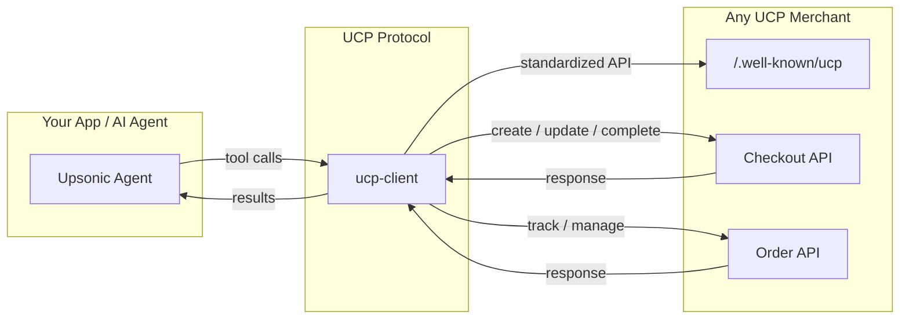

## What is UCP?

[Universal Commerce Protocol (UCP)](https://ucp.dev/) is an **open standard** that creates a common language between platforms, AI agents, and businesses. It standardizes the entire commerce lifecycle — from product discovery through checkout to post-purchase support — so the ecosystem can interoperate through **one protocol**, without custom builds for every connection.

Before UCP, every AI agent that wanted to buy something from a store needed a custom integration for that specific store. With UCP, **any agent** can transact with **any merchant** that implements the protocol — the same way HTTP lets any browser talk to any website.

<Info>
UCP was co-developed by **Google, Shopify, Etsy, Wayfair, Target, and Walmart**, and endorsed by over 30 companies including Stripe, Visa, Mastercard, PayPal, Klarna, Best Buy, Sephora, and more. It is built on industry standards — REST and JSON-RPC transports with [Agent Payments Protocol (AP2)](https://ap2-protocol.org/), [Agent2Agent (A2A)](https://a2a-protocol.org/latest/), and [Model Context Protocol (MCP)](https://modelcontextprotocol.io/) support built-in.
</Info>

---

## How It Works



A UCP transaction follows a clear lifecycle:

1. **Discovery** — The agent hits `/.well-known/ucp` on the merchant domain to learn what's supported (products, payment handlers, shipping methods).
2. **Checkout** — The agent creates a checkout session, adds items, applies discounts, sets shipping, and selects fulfillment options — all through standardized REST endpoints.
3. **Payment** — The agent completes the purchase using the merchant's supported payment handlers with cryptographic proof of user consent.
4. **Order Management** — After purchase, the agent tracks shipment, receives webhook updates, and can initiate returns or refunds.

---

## Core Capabilities

<CardGroup cols={3}>
  <Card title="Checkout" icon="cart-shopping">
    Create and manage checkout sessions with support for complex cart logic, dynamic pricing, tax calculations, and discount codes across any UCP merchant.
  </Card>
  <Card title="Identity Linking" icon="link">
    OAuth 2.0–based account connections let agents access loyalty programs, saved addresses, and order history without sharing credentials.
  </Card>
  <Card title="Order Management" icon="box">
    Track orders, receive real-time webhook updates on shipment status, and handle returns and refunds through standardized endpoints.
  </Card>
</CardGroup>

---

## Demo: Shopify Store via UCP

An Upsonic agent browsing a Shopify store, adding items to cart, and completing checkout — entirely through UCP:

<video
  controls
  className="w-full aspect-video rounded-xl"
  src="../artifacts/ucp_shopify_example.mp4"
></video>

---

## Upsonic's UCP Python Client

Upsonic maintains [`ucp-client`](https://github.com/Upsonic/ucp-client) — a Python client library that wraps the UCP protocol into LLM-friendly tools your agents can call directly.

```bash
uv pip install ucp-client
# pip install ucp-client
```

### Quick Start

```python
from ucp_client import UCPAgentTools

tools = UCPAgentTools("http://localhost:8182")

# 1. Discover merchant capabilities
merchant = tools.discover_merchant()

# 2. Get user info for buyer details
user = tools.get_your_user()

# 3. Create a cart with a single product
cart = tools.create_cart(
    product_id="bouquet_roses",
    quantity=2,
    buyer_name=user["user"]["name"],
    buyer_email=user["user"]["email"],
)

# 4. Add another product to the cart
tools.add_items_to_cart(cart["checkout_id"], "pot_ceramic", quantity=1)

# 5. Apply discount
tools.apply_discount(cart["checkout_id"], "10OFF")

# 6. Set shipping address
tools.set_shipping_address(
    checkout_id=cart["checkout_id"],
    street="123 Main St",
    city="San Francisco",
    state="CA",
    country="US",
    postal_code="94102",
)

# 7. Complete purchase
result = tools.complete_purchase(
    checkout_id=cart["checkout_id"],
    payment_token="success_token",
)
print(f"Order ID: {result['order_id']}")
```

### Use with Upsonic Agent

Pass the `UCPAgentTools` instance directly to an Upsonic Agent with `add_tools` — all UCP methods become available as agent tools automatically:

```python
from upsonic import Agent, Chat
from ucp_client import UCPAgentTools

tools = UCPAgentTools("http://localhost:8182")

agent = Agent("openai/gpt-4o")
agent.add_tools(tools)

chat = Chat(session_id="shopping", user_id="user_1", agent=agent)
response = chat.invoke("Buy 2 bouquets of roses and apply the 10OFF discount")
print(response)
```

### Available Tools

| Tool | Description |
|------|-------------|
| `discover_merchant()` | Query merchant profile, supported payment handlers, and capabilities |
| `get_available_products()` | Browse the full product catalog with prices |
| `get_available_discount_codes()` | List available discount codes |
| `get_your_user()` | Get buyer name, email, and saved shipping addresses |
| `create_cart(product_id, quantity, buyer_name, buyer_email)` | Create a checkout session with a product |
| `add_items_to_cart(checkout_id, product_id, quantity)` | Add more products to an existing cart |
| `apply_discount(checkout_id, discount_code)` | Apply a discount code to a checkout |
| `set_shipping_address(checkout_id, street, city, state, country, postal_code)` | Set delivery address and get shipping options |
| `select_shipping_option(checkout_id, option_id)` | Choose a specific shipping option |
| `get_cart_summary(checkout_id)` | Get current cart status, items, and totals |
| `save_checkout_id(checkout_id, label)` | Save a checkout ID for later reference |
| `get_saved_checkouts()` | List all saved checkout IDs |
| `complete_purchase(checkout_id, payment_token)` | Process payment and create the order |
| `cancel_checkout(checkout_id)` | Cancel and abandon a checkout session |
| `get_order(order_id)` | Get order details after purchase |

### Local Mock Server

Spin up a local UCP-compliant mock server for development and testing:

```bash
uv pip install "ucp-client[server]==0.0.11"
# pip install "ucp-client[server]==0.0.11"
ucp mockup_server
```

This starts a fully functional UCP endpoint at `http://localhost:8182` with a product catalog, checkout sessions, mock payment processing, and order tracking. Use `"success_token"` as the `payment_token` to simulate a successful payment.

---

## Why UCP Matters for AI Agents

| Without UCP | With UCP |
|---|---|
| Custom API integration per merchant | One protocol for all merchants |
| Agents can only search and link | Agents complete the full purchase |
| Breaks when merchant API changes | Standardized, versioned protocol |
| No payment interoperability | Open wallet ecosystem across providers |
| Fragmented order tracking | Unified webhooks and order management |

---

## Resources

<CardGroup cols={2}>
  <Card title="UCP Shopping Agent Example" icon="robot" href="/ucp/example-agent">
    Complete Upsonic agent that browses, carts, and checks out through UCP — with Streamlit UI.
  </Card>
  <Card title="ucp-client on GitHub" icon="github" href="https://github.com/Upsonic/ucp-client">
    Python client library with LLM-friendly tools and a built-in mock server.
  </Card>
  <Card title="UCP Specification" icon="book" href="https://ucp.dev/latest/specification/overview/">
    Full protocol spec — checkout flows, identity linking, order management, and payment handlers.
  </Card>
  <Card title="Awesome UCP" icon="star" href="https://github.com/Upsonic/awesome-ucp">
    Curated list of UCP resources, tools, and implementations from the community.
  </Card>
</CardGroup>
